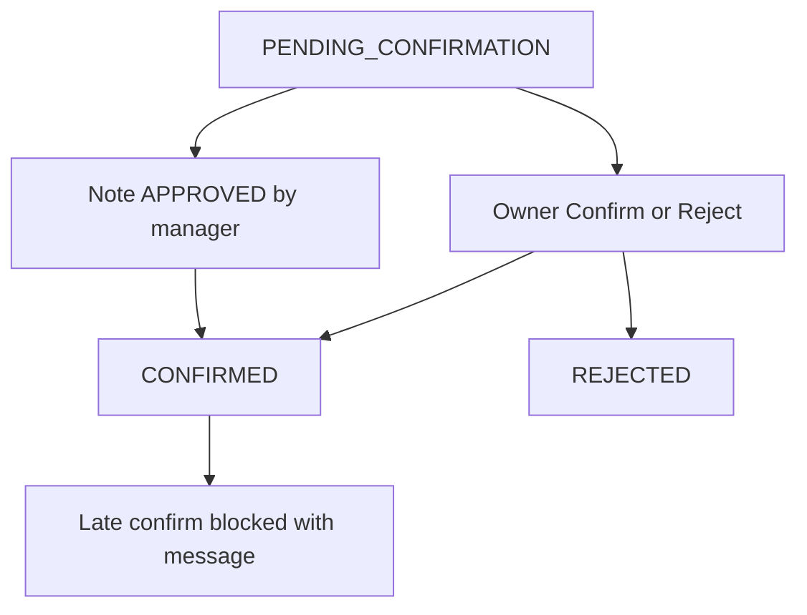

# Taahhüt onayı (1A + 2C)

## Kararlar

- **1A:** Onayla/Reddet yalnızca `PENDING_CONFIRMATION` taahhütlerde; aktörün `displayName` değeri taahhüt sahibiyle (trim + case-insensitive) eşleşmeli **ve** toplantıda aynı isimde `external === false` katılımcı olmalı. Sunucu da aynı kuralı zorunlu kılar.
- **2C:** Yönetici tutanağı `APPROVED` yaptığında tüm ilgili PENDING note taahhütleri otomatik `CONFIRMED`. Paylaşım (delivery) şart değil. Geç onay denemesinde kullanıcıya: yönetici tutanağı onayladığı/paylaştığı için işlem yapılamaz.

## Backend

### Auto-confirm on note approval
`MeetingNoteApprovalService.decideApproval` — `GRANTED` dalında, ledger append yanına:
- Notun mevcut versiyonundaki `PENDING_CONFIRMATION` taahhütleri yükle
- Her birini `approve(approverUserId, version, now)` + kaydet
- Approver `actorId` → `UUID` çözümlemesi

### Assignee confirm/reject + 2C gate
`MeetingIntelligenceApplicationService.decideCommitment`:
- Note status `APPROVED` (veya taahhüt zaten terminal ve manager path) → `COMMITMENT_LOCKED_BY_NOTE_APPROVAL`
- Aksi halde 1A: meeting participants üzerinden owner/internal eşleşmesi; yoksa forbidden
- Sonra mevcut `approve`/`reject` transition

### Portal BFF
`PortalApiController`:
- `POST /api/v1/portal/commitments/{id}/confirm`
- `POST /api/v1/portal/commitments/{id}/reject`
- Body: `{ expectedVersion }`
- `CommitmentItemView` içine `version` ekle
- Meeting detail mapping’de confirmation status’u olduğu gibi geç

### Ledger senkronu
`ApprovedNoteLedgerAdapter`: `recordCommitment` sonrası aynı id için confirm — tracker’ın PENDING’de kalmaması için.

## Frontend

`MeetingCenterPanel.tsx` commitment satırı:
- Koşul: `PENDING_CONFIRMATION` + displayName eşleşmesi + internal participant
- Onayla / Reddet butonları
- Late-lock hatasını kullanıcı mesajıyla göster

i18n TR/EN: status labels, butonlar, `meeting.commitmentLockedByNoteApproval`

## Testler

- Note GRANTED → pending → CONFIRMED
- Owner internal match → OK; external/wrong name → forbidden
- Note APPROVED → confirm → lock error

## Kapsam dışı

- Kişisel inbox (1C)
- Delivery bekleme (2B)
- Owner `userId` alanı (şimdilik display name)
