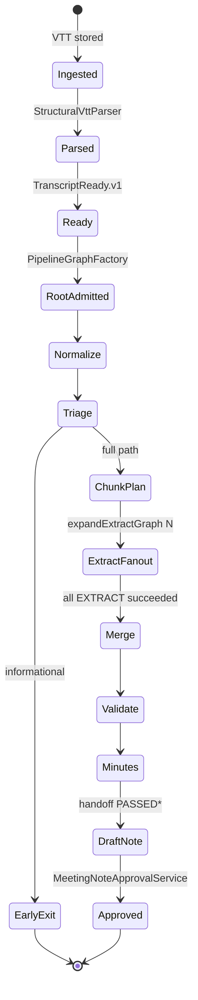
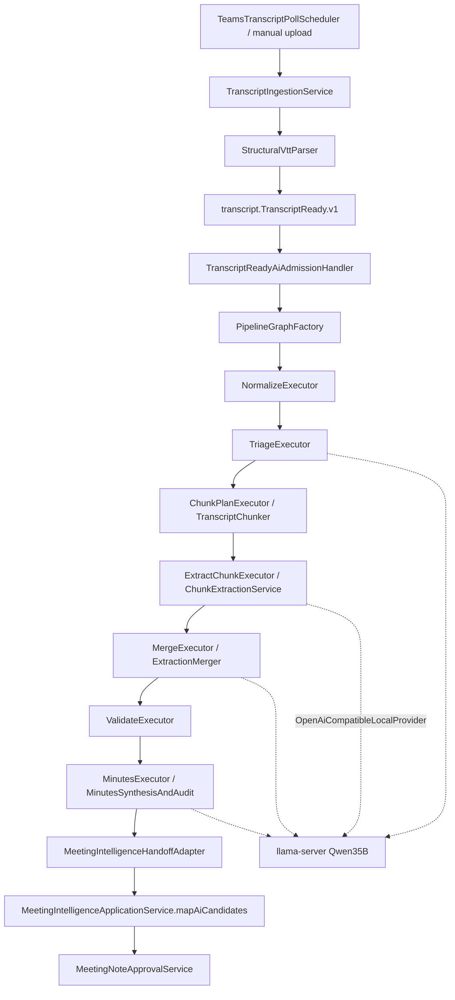

# Actenora — Mevcut Transcript / Chunk / Toplantı Tutanağı Pipeline Analizi

**Tarih:** 2026-08-06  
**Kapsam:** Salt okunur kod + config + doküman + artifact incelemesi  
**Üretim kodu değiştirildi mi:** Hayır  
**Esas kaynak:** Çalışan kod; doküman çelişirse kod kabul edilir

---

## 0. Repository haritası (ilgili parçalar)

| Alan | Gerçek konum |
|------|----------------|
| Domain modülleri | `modules/transcript`, `modules/ai-processing`, `modules/meeting-intelligence`, `modules/microsoft-connection`, `modules/approval`, `modules/delivery`, `modules/shared-kernel`, `modules/model-management` |
| API / composition root | `apps/platform-backend` |
| Portal | `apps/web-portal` |
| AI orchestrator | `apps/ai-orchestrator` — **yalnızca health / egress; LLM çağrısı yapmaz** |
| Ayrı transcript/AI worker jar | **Bulunamadı** (worker döngüsü `platform-backend` içinde `@Scheduled`) |
| Queue | RabbitMQ + outbox/inbox (`infrastructure/rabbitmq`, `actenora.messaging.mode`) |
| Object storage | MinIO (VTT raw bytes) |
| Model server | llama.cpp `llama-server` (prod script + compose `llm` profile) |
| Promptlar | `modules/ai-processing/src/main/resources/aiprocessing/prompts/` |
| Konfig | `apps/platform-backend/src/main/resources/application.yml`, `.env.example` |

### İstenen sınıf / kavram envanteri

| İsim | Durum |
|------|--------|
| `MinutesSynthesisAndAudit` | Var — `modules/ai-processing/.../MinutesSynthesisAndAudit.java` |
| `MinutesFinalizationPolicy` | Var |
| `MeetingIntelligenceApplicationService` | Var — `modules/meeting-intelligence/...` |
| `MeetingNoteApprovalService` | Var |
| `PriorMeetingContext` / `PriorMeetingContextPort` | Var; production wiring şu an `noop()` |
| `TenantDictionary` / `DictionaryMatcher` / `SpeakerResolver` | Var — transcript normalizasyon yolu |
| `TranscriptDigest` / `TranscriptDigestBuilder` | Var — COMPOSER yolu |
| `COMPOSER` / `EDITORIAL` / `FULL` / `DETERMINISTIC` | Dört finalization mode — kodda mevcut |
| Ayrı `apps/*worker*` transcript worker | **Bulunamadı** (compose’ta ölü `transcript-worker` referansı var; Dockerfile yok) |

---

## 1. Transcript sisteme nasıl giriyor?

İki birincil giriş:

### 1.1 Manuel VTT upload

1. `TranscriptController` / `TranscriptApi.uploadManualVtt` → `TranscriptIngestionService.uploadManualVtt`  
   (`modules/transcript/.../TranscriptIngestionService.java:92-170`)
2. Validasyon (`VttUploadValidator`), content-hash ile dedupe
3. Raw VTT → object storage (immutable key)
4. `publishIngested` → parse aşaması (reparse / structural parse)
5. Parse sonrası segment persist + `transcript.TranscriptReady.v1` outbox eventi

### 1.2 Microsoft Teams / Graph

1. `TeamsTranscriptPollScheduler` periyodik / event-driven poll  
   (`apps/platform-backend/.../TeamsTranscriptPollScheduler.java`)
2. `TeamsTranscriptIngestService.pollMeeting` → Graph download  
   (`MeetingTranscriptService.downloadTranscript` → `TranscriptGateway`)
3. `transcriptApi.ingestFromGraphVtt(...)`  
   (`TeamsTranscriptIngestService` → `TranscriptIngestionService.ingestFromGraphVtt:172+`)
4. Aynı Ready eventi

Varsayılan Graph poll aralığı: `PT5M` (`application.yml` → `actenora.microsoft...transcript-poll-interval`).

### 1.3 Parse birimi

- `StructuralVttParser` / `VttParser`: VTT cue → `TranscriptSegment` (timestamp, speaker, content, segment id)
- Segment bölünmez; cue bütünlüğü korunur
- Dictionary / speaker rewrite: `TranscriptNormalizer` + `DictionaryMatcher` + `SpeakerResolver` (renormalize yolu; `TranscriptNormalizationService`)

### 1.4 AI’ye admission

`TranscriptReadyAiAdmissionHandler.handle` (`apps/platform-backend/.../TranscriptReadyAiAdmissionHandler.java:140+`):

- Distributed lock: `meeting:<id>:processing`, TTL 30s
- Dil: transcript → tenant default → `tr`
- Priority: segmentCount ≥ 100 → BULK
- **Default `actenora.ai.pipeline.mode=staged`** → `PipelineGraphFactory.admitFromTranscriptReady`
- Legacy mode → tek `CHUNK_EXTRACTION` job (`AiProcessingApi.submitJob`)

---

## 2. Transcript hangi aşamalardan geçiyor?

### 2.1 Staged mode (varsayılan üretim yolu)

`ProcessingStage` + `PipelineGraphFactory` / `DefaultStageExecutors`:

```text
ROOT (anında SUCCEEDED)
 → NORMALIZE
 → TRIAGE          [LLM, opsiyonel early-exit]
 → CHUNK           [deterministik plan + artifact]
 → EXTRACT × N     [chunk başına 1 AiJob; gate + LLM]
 → MERGE           [deterministik merge + LLM candidate merge]
 → VALIDATE        [deterministik]
 → MINUTES         [finalization policy + handoff]
 → (EMBEDDING stage enum’da var; bu analizde embedding ana tutanak yolu değil)
```

Fan-out: `StageCompletionService` CHUNK tamamlanınca `expandExtractGraph(chunkCount)`  
(`PipelineGraphFactory.expandExtractGraph:180-237`).

MERGE, tüm EXTRACT bağımlılıkları tamamlanmadan claim edilmez (barrier — `StageBarrierClaimTest`).

### 2.2 Legacy / monolith mode

`ExtractionPipelineService.run` (`ExtractionPipelineService.java:276+`):

```text
normalize → chunk → extract (paralel thread pool) → deterministic merge/seed/scrub
 → deterministic validate → MinutesSynthesisAndAudit.finalizeMinutes
```

Tek job içinde uçtan uca.

### 2.3 Toplantı notu sonrası

`MeetingIntelligenceHandoffAdapter.handoff` (`:244+`):

1. Evidence quality gate
2. PASSED / PASSED_WITH_WARNINGS / MANUAL_REVIEW_REQUIRED → `mapAiCandidates` → DRAFT note
3. REJECTED → note yok
4. Organizer mail: `DeliveryApi` (DRAFT_ORGANIZER)
5. Onay: `MeetingNoteApprovalService` (TTL 7 gün adapter sabiti)

---

## 3. Uçtan uca aşama tablosu

| Aşama | Giriş | Çıkış | Sınıf/metot | Sync/async | Kalıcılık | Model çağrısı | Retry | Timeout |
|-------|-------|-------|-------------|------------|-----------|---------------|-------|---------|
| Graph/manual ingest | VTT bytes | Transcript + storage key | `TranscriptIngestionService.uploadManualVtt` / `ingestFromGraphVtt` | Async event | DB + MinIO | Yok | Dedupe by hash / external id | Upload validator; Graph client ayrı |
| VTT parse | Raw VTT | `TranscriptSegment[]` | `StructuralVttParser` / `VttParser` | Sync in parse job | Segment tabloları | Yok | Reparse komutu | — |
| Dictionary normalize | Segments + dictionary | Normalized segments | `TranscriptNormalizer.normalize` | Sync (renormalize) | Normalized artifact | Yok | — | — |
| TranscriptReady | Ready event | AiJob graph / job | `TranscriptReadyAiAdmissionHandler.handle` | Async consumer | `ai_job` + idempotency key | Yok | Lock skip; job idempotency | Lock TTL 30s |
| NORMALIZE (AI) | Segments | segmentCount artifact | `DefaultStageExecutors.NormalizeExecutor` | Job | Stage artifact | Yok | Job attempts | Worker stale 24h |
| TRIAGE | Transcript sample ≤6k char | triage JSON / earlyExit | `TriageExecutor.execute` | Job | Stage result | **1× MEETING_TRIAGE** | Fail-open fallback JSON | **120s** hardcoded |
| CHUNK | Normalized segments | `chunk-plan` JSON | `ChunkPlanExecutor` + `TranscriptChunker` | Job | `chunk-plan` artifact | Yok | — | — |
| EXTRACT (chunk i) | Chunk i segments | `chunk-extraction-i` | `ExtractChunkExecutor` + `ChunkExtractionService` | Job (N paralel claim edilebilir) | Per-chunk artifact + gate artifact | **0–1×** (gate skip) / **1× CHUNK_EXTRACTION** | Job-level attempts; **staged path’te INVALID_JSON in-chunk retry yok** | **1800s** hardcoded |
| MERGE | chunk-extraction-* | merged JSON | `MergeExecutor` + `ExtractionMerger` | Job (barrier) | merged artifact | **1× CANDIDATE_MERGE** (+ deterministik fallback) | Job retry | **1800s** |
| VALIDATE | merged bundle | validated | `ValidateExecutor` + `DeterministicExtractionValidator` | Job | validated artifact | Yok | — | — |
| MINUTES | validated + segments | FinalNoteDraft + note | `MinutesExecutor` + `MinutesSynthesisAndAudit` | Job | `final-minutes`, provenance, quality pack | Mode’a göre 0–2+ | Finalization failure → deterministic (config) | Policy: default **1800s** |
| Handoff | FinalNoteDraft | Meeting note DRAFT | `MeetingIntelligenceHandoffAdapter.handoff` | Sync in minutes success | MI tables + delivery | Yok | — | Approval TTL 7d |
| Approval / delivery | Human action | Approved note / send | `MeetingNoteApprovalService` + delivery workers | Async | Approval + delivery | Yok | Delivery retries (delivery modülü) | — |

Legacy EXTRACT satırı: aynı LLM extraction; `ExtractionPipelineService.extractChunkWithRetry` ile INVALID_JSON için reduced-context + split retry vardır (`:614-753`).

---

## 4. Chunk oluşturma algoritması

### 4.1 Kod

- `TranscriptChunker.chunk` — `modules/ai-processing/.../TranscriptChunker.java:24-58`
- Strateji sarmalayıcı: `TokenWindowChunkingStrategy`
- Config: `ChunkingConfig.productionDefaults` ← `MeetingLlmBudgets`

### 4.2 Birim

| Soru | Cevap (kod) |
|------|-------------|
| Chunk birimi | **Bütün VTT/segment** (`SegmentInput`); segment ortasından bölünmez |
| Boyut ölçüsü | **Yaklaşık token** = `(content.length() + 3) / 4` (`ApproximateTokenEstimator.java:9-13`) |
| Kelime / süre / semantic embedding | Kullanılmaz (marker/signal boundary polish var; embedding-based split yok) |
| Max target | `TARGET_CHUNK_TOKENS=3500`, hard `MAX_CHUNK_TOKENS=4500` |
| Min chunk | Tek segment her zaman sığar: `selectEnd` en az `start+1` alır (`:74-76`) — tek cue target’ı aşsa bile **bütün cue tek chunk** |
| Overlap | Evet — `OVERLAP_TOKENS=250` (effective overlap formülü `ChunkingConfig.effectiveOverlapTokens`) |
| Cümle ortası bölünme | Segment sınırında değilse hayır; **cue içinde bölünme yok** |
| Uzun tek cue | Tek segment olarak chunk’a girer; target aşımı kabul edilir |
| Sessizlik / zaman boşluğu | Chunker’da dikkate alınmaz |
| Önceki/sonraki bağlam | Overlap ile önceki segmentler tekrarlanır; ayrıca gate için neighbor **signal summary** (LLM’e full neighbor transcript değil) |
| Sıra | `TranscriptChunk.index` 0..N-1 |
| Timestamp / speaker / evidence id | Segment alanlarında korunur; `joinedContent` speaker prefix ekler (`TranscriptChunk.java:29-38`) |
| Aynı bilgi birden fazla chunk’ta | **Evet** — overlap nedeniyle |
| Karar iki chunk’a bölünürse | Overlap + continuation-aware gate + merge/dedupe/grounding; garantili yakalama iddiası yok (kalite riski) |

### 4.3 Boundary polish

1. Token dolana kadar segment ekle (`selectEnd`)
2. `preferMarkerBoundary` — yakındaki marker’a snap (lookback ≤3)
3. `preferSignalAwareBoundary` — son marker sonrası yeterince filler varsa marker’da kes
4. `nextStart` — overlap token kadar geriye; mümkünse marker’a oturt; `next <= start` ise `end` (sonsuz döngü koruması)

### 4.4 Effective budget (operational ctx)

`MeetingLlmBudgets` (`:15-58`):

```text
OPERATIONAL_CTX_SIZE     = 16384
PROMPT_OVERHEAD_TOKENS   = 2500
EXTRACTION_MAX_TOKENS    = 6144
SAFETY_MARGIN_TOKENS     = 1000
usable ≈ 16384 - 2500 - 6144 - 1000 = 6740
effectiveTarget = min(4500, 3500) = 3500  (usable ≥ target)
effectiveOverlap ≈ 250
```

Not: Prod llama-server script’i `CTX_SIZE=32768` kullanabilir; pipeline chunking yine **16k operational** ile clamp eder (`operationalContextWindow`).

### 4.5 Chunk konfigürasyon tablosu

| Ayar | Mevcut değer | Varsayılan | Kaynak | Env ile değişir mi? |
|------|-------------:|-----------:|--------|---------------------|
| targetChunkTokens | 3500 | 3500 | `MeetingLlmBudgets.TARGET_CHUNK_TOKENS` | Hayır (kod sabiti) |
| maxChunkTokens | 4500 | 4500 | `MeetingLlmBudgets.MAX_CHUNK_TOKENS` | Hayır |
| overlap | 250 | 250 | `MeetingLlmBudgets.OVERLAP_TOKENS` | Hayır |
| operational ctx | 16384 | 16384 | `OPERATIONAL_CTX_SIZE` | Hayır (registry üst sınır clamp) |
| extraction max_tokens | 6144 | 6144 | `EXTRACTION_MAX_TOKENS` | Hayır |
| prompt overhead reserve | 2500 | 2500 | `PROMPT_OVERHEAD_TOKENS` | Hayır |
| signal gate enabled | true | true | `application.yml` `actenora.meeting.signal-gate.enabled` | Evet |
| gate threshold | 4.5 | 4.5 | aynı | Evet |
| uncertain band | 2.0 | 2.0 | aynı | Evet |

### 4.6 Yaklaşık chunk sayısı (çıkarım)

**Yöntem:** `ApproximateTokenEstimator` ile dialogue karakterlerinden token; greedy window target=3500, overlap=250.  
**Varsayım A — bim-tanisma ölçekleme:** gerçek eval transcript ~48.2 dk, ~11175 approx token → ~**4 chunk**; ~232 token/dk.

| Toplantı süresi (varsayım) | Approx transcript token | Tahmini chunk |
|----------------------------|------------------------:|--------------:|
| 15 dk | ~3500 (bim rate) / standup gold ~2023 | **1** |
| 30 dk | ~6950 | **~3** |
| 60 dk | ~13900 | **~5** |
| 90 dk | ~20850 | **~7** |
| 120 dk | ~27800 | **~9** |
| bim-tanisma (~48 dk, ölçülmüş) | ~11175 | **~4** |

**Varsayım B — 15 dk gold fixture:** `01_15dk_daily_standup.vtt` ≈ 2023 token → **1 chunk** (ölçülmüş karakter hesabı).

Bu sayılar uydurma benchmark değildir; estimator + sabitlerle aritmetik tahmindir. Gerçek chunkCount artifact’ları çoğu eval run’da raporda **NOT_AVAILABLE**.

---

## 5. LLM çağrı analizi

### 5.1 Çağrı envanteri

| Çağrı adı | Pipeline aşaması | Task / model alias | Girdi kapsamı | Max token (out) | Temperature | Timeout | Retry | Kaç kez |
|-----------|------------------|--------------------|---------------|----------------:|------------:|--------:|------:|--------:|
| Triage | TRIAGE | `MEETING_TRIAGE` / role router → served model | İlk ≤6000 char sample | 512 | 0.1 / topP 0.85 / topK 20 (`LocalProviderModelRuntimeAdapter`) | 120s | Fail-open, model retry job-level | **0–1** (staged) |
| Chunk extraction | EXTRACT | `CHUNK_EXTRACTION` | System rules + chunk-extraction template + chunk text + evidence ids | 6144 | aynı | 1800s staged / request timeout legacy | Staged: job attempts. Legacy: INVALID_JSON ×2 + split | **0–1** per chunk (+ legacy retries) |
| Candidate merge | MERGE | `CANDIDATE_MERGE` | Deterministik merge özeti + bundle count (full bundles LLM’e gitmiyor; schema-valid ise LLM JSON tercih) | 2048 | aynı | 1800s | Schema fail → deterministic JSON | **1** (staged) |
| Editorial summary | MINUTES (EDITORIAL default) | `FINAL_NOTE` (config task type) | validatedMinutes JSON − executiveSummary | **768** (yml) | aynı | 1800s | Fallback deterministic | **0–1** |
| Global composer | MINUTES (COMPOSER) | `FINAL_NOTE` | Digest + ledger | 8192 | aynı | policy | Fallback editorial/deterministic | **1** (+ opsiyonel editorial) |
| Final synthesis | MINUTES (FULL) | `FINAL_NOTE` | candidates + prior context | 8192 | aynı | policy/timeoutSeconds | Fallback draft | **1** |
| Evidence audit | MINUTES (FULL) | `VALIDATION` | draft candidates | 2048 | aynı | aynı | Fallback | **1** |
| Gate classifier | EXTRACT pre-infer | Heuristic local classifier | Features | — | — | — | — | **LLM değil** |

Served model (eval / .env.example): `nanobase-qwen36-35b-a3b-mtp` — OpenAI-compatible `base-url` (default `:8010`).

### 5.2 Prompt parçaları (extraction)

| Prompt parçası | Her chunk’ta var mı? | Yaklaşık boyut | Dinamik mi? | Gereksiz tekrar riski |
|----------------|----------------------|---------------:|-------------|------------------------|
| System rules (`ExtractionPromptRules` ← system-meeting-analyst) | Evet | ~1100 token (v2 dosya ~4374 char) | Dil ekleri | **Yüksek** — her çağrıda yeniden |
| `chunk-extraction.v1.txt` template | Evet | ~1400 token | Placeholder fill | Yüksek |
| Chunk transcript | Evet | ≤~3500 target (tek cue ile daha büyük olabilir) | Evet | Overlap tekrarı |
| Evidence segment id list | Evet | Küçük | Evet | Düşük |
| Participants / meetingDate | Template slot; staged extract’te çoğu zaman **boş string** | 0 | Kısmen | — |
| Prior meeting context | Extraction’ta yok; FULL synthesis’te var | — | Port şu an noop | Şu an eklenmiyor |
| Tenant dictionary | Chunk prompt’una otomatik gömülmez (normalize aşamasında metne yazılmış olabilir) | — | — | — |
| JSON schema | Validator tarafında; model output schema id ile | — | Sabit | Tokenizer’da schema metni ayrıca gönderilmiyorsa düşük |

Prompt caching / KV prompt cache (uygulama katmanı): **bulunamadı**. llama.cpp KV cache server tarafında var; “prompt cache hit” metriği bu repo analizinde doğrulanmadı.

### 5.3 Toplam LLM çağrı formülü

**Staged + EDITORIAL (varsayılan config):**

```text
Toplam = 1 (TRIAGE)
       + Σ_i [gate_skip_i ? 0 : 1]     // EXTRACT
       + 1 (MERGE LLM)
       + 1 (EDITORIAL)                 // failure → 0 ek model, deterministic summary
       + job-level provider retries
```

Informational early-exit (triage): EXTRACT/MERGE/MINUTES genişlemesi atlanabilir → **~1 çağrı**.

**Staged + FULL:**

```text
Toplam = 1 + N_extract + 1 + 2 (synthesis + audit)
```

**Staged + COMPOSER:**

```text
Toplam = 1 + N_extract + 1 + 1..2 (composer ± editorial fallback)
```

**Staged + DETERMINISTIC:**

```text
Toplam = 1 + N_extract + 1 + 0
```

**Legacy + EDITORIAL:**

```text
Toplam = N_extract (+ INVALID_JSON retries 0..2+split) + 1 editorial
```

TRIAGE/MERGE yok.

### 5.4 Süre örnekleri (formül uygulaması, varsayımlı N)

Gate skip=0, retry=0, staged+editorial:

| Süre | N_chunk (tahmin) | Toplam LLM |
|------|-----------------:|-----------:|
| 15 dk | 1 | **4** |
| 30 dk | 3 | **6** |
| 60 dk | 5 | **8** |
| 90 dk | 7 | **10** |
| 120 dk | 9 | **12** |

---

## 6. Concurrency ve threading

### 6.1 Katman tablosu

| Katman | Concurrency değeri | Queue kapasitesi | Thread tipi | Blocking mi? | Kaynak |
|--------|-------------------:|------------------|-------------|--------------|--------|
| Provider global semaphore | **4** | tryAcquire fail-fast | OS thread (caller) | Evet (slot yoksa hata) | `max-concurrency` |
| Extraction semaphore | **2** | aynı | aynı | Evet | `max-concurrency-extraction` |
| Final/merge semaphore | **1** | aynı | aynı | Evet | `max-concurrency-final` |
| Legacy parallelChunkLimit | = extraction max (typ. 2) | FixedThreadPool | `ai-chunk-extract` daemon | Evet (infer) | `AiJobInferenceExecutor` / `ExtractionPipelineService:502` |
| Staged EXTRACT jobs | N job; claim + provider limit | Rabbit prefetch **1** (LLM factory) | Worker poll + listener | Evet | `AiStageRabbitListenerConfiguration` |
| Fast stage prefetch | 4 | — | — | — | aynı |
| Parser prefetch | 10 | — | — | — | aynı |
| Worker poll | 1 job claim / tick (typ.) | DB job queue | `@Scheduled` PT15S | — | `application.yml` worker |
| llama-server parallel slots | **1** (prod restore script) / compose llm-fast **2**, llm-final **1** | Server internal queue | llama threads | Evet | `restore-meeting-35b-llm.sh`, compose |
| Rate limit | 60/min | — | — | Evet | `rate-limit-per-minute` |
| DB pool | Spring datasource (değer bu analizde ölçülmedi) | — | — | — | Bilinmiyor |
| Admission lock | 1 meeting processing | — | — | — | 30s TTL |

### 6.2 Net cevaplar

1. **Aynı toplantının chunk’ları paralel mi?**  
   - Legacy: evet, `min(parallelChunkLimit, N)` thread.  
   - Staged: ayrı EXTRACT job’ları; teoride birden fazla claim; pratikte **extraction semaphore=2** + **llama `-np 1`** → büyük ölçüde sıraya girer.
2. **Aynı anda birden fazla toplantı?** Evet (global semaphore 4; meeting lock sadece admission).
3. **Tenant limit?** Admission/quota testleri var (`QuotaUnderLoadScenarioTest`); inference semaphore tenant-aware değil.
4. **Global limit?** Evet — max-concurrency=4.
5. **Model/task limit?** Evet — extraction 2, final 1.
6. **CPU oversubscription?** Java worker az thread; asıl risk **llama `-t 24` + JVM** aynı hostta. Ölçüm eksik.
7. **LLM parallel vs Java concurrency çakışması?** **Evet** — Java 2 extract isteği gönderebilir; server `-np 1` ise kuyruk + bekleme.
8. **Çok paralel → throughput düşüşü?** Olası (KV thrash / context switch); kod kanıtı yok, mimari risk **MEDIUM**.
9. **Queue backpressure?** `QueueDepthGuard` (load test); Rabbit prefetch=1 LLM.
10. **OOM koruması?** Prior context `noop` (EVAL OOM izolasyonu). Chunk/job OOM hard-limit **bulunamadı**. Stale running 24h.

---

## 7. Persist / state / idempotency

| Konu | Gerçek |
|------|--------|
| Chunk DB | Segmentler transcript şemasında; AI chunk plan/extraction **processing artifacts** |
| Partial LLM | Staged: `chunk-extraction-{i}`, `chunk-gate-{i}` |
| Retry’da başarılı chunk | Staged barrier: başarılı extract artifact kalır; failed extract job retry. Legacy: tek run in-memory |
| Resume | Staged DAG bağımlılıkları ile kısmi devam |
| Idempotency | `meeting:<id>:root:<hash>:pv:v2` (+ child keys) |
| İki worker aynı toplantı | Admission lock + active-job duplicate check; claim race DB’ye bağlı |
| Stale job | `stale-running-after` PT24H; `reclaim-orphans-on-startup` |
| Prompt/result cache | Uygulama cache **bulunamadı** |
| Transcript dedupe | Content hash / external transcript id |



---

## 8. Failure / retry / timeout

| Failure noktası | Retry | Backoff | Aynı model mi? | Fallback | Duplicate riski |
|-----------------|------:|---------|----------------|----------|-----------------|
| Provider HTTP / model down | max-attempts **5** (provider) / job **3** default executor | Job requeue (sınıflandırıcı) | Evet | — | Idempotency key |
| INVALID_JSON (legacy extract) | reduced context + split | Yok (anında) | Evet | Partial chunk fail → diğer chunk’lar merge | Düşük |
| INVALID_JSON (staged extract) | Job attempt; **in-chunk reduce/split yok** | Job | Evet | Boş/fail artifact | Orta |
| MERGE LLM schema fail | — | — | — | Deterministik merged JSON | Düşük |
| EDITORIAL fail | — | — | — | Deterministic draft (`failure-mode=deterministic`) | Düşük |
| FULL synthesis/audit fail | — | — | — | Deterministic flags | Düşük |
| TRIAGE fail | — | — | — | Fail-open full path | Düşük |
| Read timeout | 7200s yml / 1800s .env.example | — | — | Job fail/retry | — |
| Chunk timeout → tüm toplantı? | Hayır (staged); legacy’de MODEL_UNAVAILABLE abort, diğer permanent chunk skip | | | | |
| Final fail → extract yeniden? | Hayır (artifact’lar durur; minutes job retry) | | | | |

Circuit breaker: klasik Resilience4j CB **bu incelemede ana extraction path’te bulunamadı** (retry classifier var).

---

## 9. Model server / inference altyapısı

| Özellik | Değer | Kaynak |
|---------|-------|--------|
| Teknoloji | **llama.cpp** `llama-server` | compose + `scripts/server/restore-meeting-35b-llm.sh` |
| Alternatif | Ollama URL örneği `.env.example` | Opsiyonel |
| vLLM / TGI / ONNX runtime (aktif prod path) | Compose/docs’ta bahis; **varsayılan meeting path llama.cpp** | |
| Model dosyası | `Qwen3.6-35B-A3B-UD-Q4_K_XL.gguf` | restore script |
| Alias | `nanobase-qwen36-35b-a3b-mtp` | |
| Quantization | UD-Q4_K_XL (dosya adından) | |
| CTX | **32768** (script) / compose services **16384** | Çelişki — §H |
| Threads | **24** | script |
| Batch / ubatch | 1024 / 256 | |
| Parallel slots | **1** | `-np ${PARALLEL}` |
| Speculative | draft-mtp, n-max 2 | |
| KV cache type | k/v `q4_0` | |
| mlock | evet | |
| flash attention / NUMA / affinity | **konfigürasyonda bulunamadı** | |
| GPU layers | compose `-ngl 0` (CPU) | |
| Endpoint | `http://127.0.0.1:8010` (maskelenmiş; local) | |
| ai-orchestrator | Health only — chat completions **yok** | `apps/ai-orchestrator/.../main.py` |

---

## 10. CPU / RAM tüketim noktaları

| Bileşen | CPU etkisi | RAM etkisi | Ölçüm mevcut mu? | Kaynak |
|---------|------------|------------|------------------|--------|
| llama 35B Q4 inference | **Çok yüksek** (24 thread) | Model + KV (ctx 16k–32k, np=1) | Eval wall-clock var; RSS yok | restore script, eval |
| Prompt+chunk+output tokens | Inference süresini büyütür | KV cache | Token sayacı response’ta var; per-stage histogram eksik | MeetingLlmBudgets |
| Paralel extract (Java 2) | Bekleme / kuyruk | İkinci request buffer | Yok | semaphores vs -np 1 |
| JVM heap / worker | Orta | Heap + thread stacks | Yok | platform-backend |
| Segment reload+rechunk her EXTRACT | CPU tekrarlı | Transient list copies | Yok | `ExtractChunkExecutor:544-548` |
| JSON parse/repair | Düşük-orta | Response string | Yok | LimitedJsonRepair |
| DB / Rabbit payload | Düşük | Artifact JSON | Yok | |
| Embedding (hash mode default) | Düşük | Küçük | — | `knowledge.embedding.mode=hash` |
| OCR/ASR | **Yok** (hazır VTT) | — | — | |
| PriorMeetingContext | Devre dışı (OOM şüphesi) | — | Comment in config | `AiProcessingPlatformConfiguration:422-424` |

### Metrik isimleri (kodda görülenler)

- `PipelineRunMetrics` — chunkCount, failedChunkCount, invalidJsonRetry, model usage per stage
- `ChunkGateMetrics` / `ChunkGateMetricListener`
- `StageMetricsPort` / `earlyExitTotal`
- `PipelineQualityMetricsPort.recordFallback`
- `SafeInferenceLog` worker_heartbeat (`inFlight`, `maxConcurrency`)
- llama-server `--metrics` (Prometheus endpoint — scrape config bu analizde doğrulanmadı)
- Micrometer meter adları production wiring’de kısmen adapter’a bağlı; **tam Prometheus isim listesi eksik**

---

## 11. Performans kanıtları (repo içi)

### 11.1 15 dk standup — C_CANDIDATE runs

Kaynak: `artifacts/easymeeting-quality/C_CANDIDATE_ACTION_TITLE_CONTEXT/.../stability.json` + `runtime-metrics.json`

| Alan | Değer |
|------|-------|
| Tarih | 2026-08-04 |
| Fixture | 15 dk daily standup VTT (~2023 approx token → ~1 chunk) |
| Model | `nanobase-qwen36-35b-a3b-mtp` |
| durationMs | 763537, 733515, 727618, 716220, 797322 |
| P50 | **~733515 ms (~12.2 min)** |
| P95 (sample max) | **~797322 ms (~13.3 min)** |
| attemptCount | 1 (hepsi) |
| Başarı | 5/5 SUCCEEDED |

**Yorum (çıkarım):** Tek chunk’lık kısa toplantıda ~12 dk wall-clock → birincil maliyet **model inference latency** (ve staged’de triage+merge+editorial ek çağrıları), chunk sayısı değil.

### 11.2 Real Teams bim-tanisma

Kaynak: `artifacts/eval/real-teams/2026-08-05_bim-tanisma/`

| Alan | Değer |
|------|-------|
| segmentCount | 541 |
| approx tokens | ~11175 |
| süre (VTT) | ~48.2 dk |
| servedModelId | `nanobase-qwen36-35b-a3b-mtp@local-v1` |
| promptVersion | `pv-meeting-chunk-extraction-v2` |
| End-to-end durationMs | **Bu artifact setinde runtime-metrics yok** |

### 11.3 Load test

`docs/reviews/LOAD-TEST-REPORT.md` — in-process harness (gerçek 35B latency değil): 30 meetings/day, 100-job burst, QueueDepthGuard. CRITICAL SLA 5 dk hedefi dokümante; BULK breach tracking.

---

## 12. Doküman ↔ kod çelişkileri

```text
Doküman (README):
AI process = Python FastAPI (ai-orchestrator)

Kodda gerçekleşen:
platform-backend → OpenAI-compatible llama-server; ai-orchestrator health-only.
application.yml açıkça uyarıyor: orchestrator’a base-url vermeyin.

Karar:
Kod mevcut çalışma biçimi olarak kabul edildi.
```

```text
Doküman (handoff / bazı review metinleri):
Finalization üç path (editorial / full / deterministic) vurgusu

Kodda gerçekleşen:
MinutesFinalizationPolicy.Mode = FULL | EDITORIAL | DETERMINISTIC | COMPOSER (dört)

Karar:
Kod esas; COMPOSER mevcut.
```

```text
Doküman / MeetingLlmBudgets comment:
Server ctx çoğu zaman 16k; chunking 16k

Prod script:
CTX_SIZE=32768

Compose llm-*:
-c 16384

Karar:
Chunking operational 16k; server ctx ortama göre 16k veya 32k. Pipeline 16k’ya clamp eder.
```

```text
application.yml read-timeout default:
7200s

.env.example:
1800s

Karar:
Deploy hangi env’i inject ediyorsa o geçerli; yml default 7200s.
```

```text
Handoff: provider max-attempts 5; job max-attempts 3

Kod:
LocalProviderProperties / yml max-attempts=5;
AiJobInferenceExecutor.DEFAULT_MAX_ATTEMPTS=3

Karar:
İki katman ayrı; ikisi de var.
```

```text
Legacy ExtractionPipelineService: INVALID_JSON reduce/split retry

Staged ExtractChunkExecutor:
Aynı in-chunk retry yok

Karar:
Varsayılan staged mode’da legacy retry davranışını varsayma.
```

---

## 13. Ana sorulara kısa cevaplar (1–14)

1. **Transcript girişi:** Manuel VTT veya Graph poll → MinIO + DB → `TranscriptReady.v1`.
2. **Aşamalar:** Parse/normalize → staged DAG (NORMALIZE→TRIAGE→CHUNK→EXTRACT×N→MERGE→VALIDATE→MINUTES) → MI handoff → approval.
3. **Chunk:** Segment pencereleri; ~3500 token target; 250 overlap; marker polish.
4. **Model/servis:** Her extract chunk için local OpenAI-compatible completion; triage/merge/final ayrıca.
5. **Birleştirme:** `ExtractionMerger` (deterministik) + staged’de ek `CANDIDATE_MERGE` LLM; sonra seed/scrub/grounding/action post.
6. **LLM sayısı:** Formül §5.3; 15 dk editorial ≈ 4 çağrı (1 chunk, skip yok).
7. **CPU/RAM artıran:** 35B CPU inference, büyük prompt+chunk+max_tokens, paralel slot baskısı, rechunk kopyaları.
8. **Eşzamanlılık:** Extraction ≤2, final ≤1, global ≤4; server np=1; çok toplantı admission ile mümkün.
9. **Queue/pool/sem/retry/timeout:** §6–8.
10. **Uzun toplantı süresi:** N_chunk ↑ → extract çağrıları ↑; her çağrı CPU’da dakikalar; merge/final ek; np=1 serializes.
11. **Darboğazlar:** §E.
12. **Deterministik vs LLM:** § aşağıdaki matris.
13. **Doküman farkı:** §12.
14. **Ölçülmeden bilinmesi gerekenler:** §J + birincil nedenler §K.

### Deterministik vs LLM matrisi

| Parça | Tip |
|-------|-----|
| VTT parse, dedupe, sort | Deterministik |
| Dictionary / speaker resolve | Deterministik |
| Chunking / signal gate features | Deterministik |
| Chunk extraction | **LLM** |
| JSON repair / schema / evidence grounding | Deterministik |
| Cross-chunk merge (ExtractionMerger) | Deterministik |
| Staged CANDIDATE_MERGE | **LLM** (+ deterministic fallback) |
| Seeders, action post, consistency auditor | Deterministik |
| FinalNoteAssembler | Deterministik |
| EDITORIAL / COMPOSER / FULL synth+audit | **LLM** |
| Handoff quality gate mapping | Deterministik kurallar + validation |

---

## A. Mevcut mimarinin kısa özeti

1. Modular monolith: transcript + ai-processing + meeting-intelligence `platform-backend` içinde.
2. VTT MinIO’da; segmentler Postgres’te.
3. Ready eventi AI job grafiğini açar (default staged).
4. Chunker segment-token penceresi (3500/250).
5. Signal gate düşük sinyali LLM’siz atlayabilir.
6. Her chunk ayrı EXTRACT job + artifact.
7. Merge önce deterministik, sonra LLM adayı (geçersizse geri düş).
8. Varsayılan finalization EDITORIAL: yapısal maddeler korunur, 1 özet çağrısı.
9. COMPOSER/FULL/DETERMINISTIC config ile seçilir.
10. Handoff DRAFT note + mail; insan onayı zorunlu.
11. LLM: local llama.cpp Qwen3.6-35B-A3B Q4, CPU, `-np 1`.
12. Java semaphores 4/2/1; server parallel 1 → kuyruk.
13. PriorMeetingContext production’da noop.
14. ai-orchestrator inference yapmaz.
15. Temperature 0.1 / topP 0.85 / topK 20.
16. Worker 15s poll; stale 24h.
17. Idempotent admission keys + short distributed lock.
18. Eval: 15 dk toplantı ~12 dk wall-clock.
19. Uzun toplantıda süre kabaca chunk × yavaş CPU infer.
20. Performans optimizasyonu öncesi per-stage token/latency ölçümü eksik.

---

## B. Uçtan uca Mermaid (sınıf adlarıyla)



---

## C. Bir toplantı için çağrı ağacı (staged + EDITORIAL)

```text
Meeting AiJob graph
├── ROOT (no LLM)
├── NORMALIZE (no LLM)
├── TRIAGE
│   └── MEETING_TRIAGE LLM ×1
├── CHUNK plan (no LLM) → expand N
├── EXTRACT chunk 0..N-1
│   ├── ChunkSignalGate (deterministic)
│   └── CHUNK_EXTRACTION LLM ×0|1  [+ job retry]
├── MERGE
│   ├── ExtractionMerger (deterministic)
│   └── CANDIDATE_MERGE LLM ×1
├── VALIDATE (deterministic)
└── MINUTES
    ├── FinalNoteAssembler (deterministic)
    ├── EDITORIAL LLM ×0|1
    └── MeetingIntelligenceHandoffAdapter (no LLM)
```

Legacy monolith: TRIAGE/MERGE LLM yok; extract paralel pool; finalization aynı policy.

---

## D. Gerçek LLM çağrı formülü + süre örnekleri

```text
Staged + EDITORIAL (default):
  calls ≈ 1 + N_extract_effective + 1 + 1
  N_extract_effective = chunks - hard_skips (+ retries)

Staged + FULL:
  calls ≈ 1 + N_extract_effective + 1 + 2
```

| Süre | N (tahmin) | EDITORIAL calls | FULL calls |
|------|-----------:|----------------:|-----------:|
| 15 | 1 | 4 | 5 |
| 30 | 3 | 6 | 7 |
| 60 | 5 | 8 | 9 |
| 90 | 7 | 10 | 11 |
| 120 | 9 | 12 | 13 |

Varsayımlar: gate skip=0, triage early-exit yok, staged mode, retry=0, bim-benzeri konuşma yoğunluğu.

---

## E. Darboğaz sıralaması

| Sıra | Darboğaz | Kanıt | Etki | Güven |
| ---: | -------- | ----- | ---- | ----- |
| 1 | CPU’da 35B llama inference latency | 15 dk / ~1 chunk eval ≈ 12 dk; `-t 24`, `-ngl 0`, model Q4 35B | Toplantı süresini domine eder | **HIGH** |
| 2 | Chunk sayısıyla çarpan extract çağrıları | Chunker 3500/250; staged N job; her biri max_tokens 6144 | Uzun toplantıda neredeyse doğrusal büyüme | **HIGH** |
| 3 | llama `-np 1` vs Java extraction concurrency 2 | restore script PARALLEL=1; semaphore extraction=2 | Paralel Java istekleri sunucuda sıraya girer | **HIGH** |
| 4 | Staged ek LLM: TRIAGE + MERGE (+ editorial) | DefaultStageExecutors Triage/Merge; yml editorial | Kısa toplantıda bile ≥3–4 çağrı | **HIGH** |
| 5 | Büyük sabit prompt overhead her chunk’ta | system + extraction template ~2.5k reserve; her infer’da tekrar | Token/s ve KV baskısı | **MEDIUM** |
| 6 | EXTRACT job’larında full transcript reload+rechunk | ExtractChunkExecutor her seferinde normalize+chunk | CPU/IO tekrarı (LLM yanında ikincil) | **MEDIUM** |
| 7 | Long read timeouts / slow fail | 1800–7200s | Başarısız işler kaynağı uzun tutar | **MEDIUM** |
| 8 | INVALID_JSON job retry (staged, reduce yok) | Legacy’de reduce/split var; staged’de yok | Uzun prompt’un kör tekrarı | **MEDIUM** |

---

## F. CPU/RAM darboğazları (ayrı)

| Alan | Değerlendirme |
|------|----------------|
| Model inference | Birincil CPU + RAM (model weights + KV) |
| Prompt/context büyüklüğü | Her extract’te tekrar; operational 16k bütçe |
| Paralel chunk | Java 2; server 1 → kuyruk, thrash riski |
| Java worker | İkincil |
| Database | Artifact JSON; birincil değil (ölçüm yok) |
| Queue | Prefetch 1; backpressure guard testte var |
| Network | Localhost HTTP; genelde ikincil |
| Serialization | JSON repair/parse; ikincil |
| Retry | Süreyi çoğaltır |
| Final synthesis | EDITORIAL küçük (768); FULL/COMPOSER ağır (8192) |

---

## G. Bilinmeyenler

- Prod host’ta gerçek process RSS / JVM heap / llama RSS
- Per-stage input/output token histogramları (eval pack’te chunkCount çoğu yerde NOT_AVAILABLE)
- Model queue wait vs pure generate time ayrımı
- Prompt cache hit oranı
- Multi-replica claim contention gerçek üretim sayıları
- Tenant başına eşzamanlı meeting throughput ölçümü
- bim-tanisma / 1h toplantılar için wall-clock durationMs
- Embedding openai-compatible mode açıldığında ek maliyet
- DB connection pool boyutu (aktif profil)
- Signal gate’in üretimde gerçek skip oranı

---

## H. Çelişkiler (özet liste)

1. README ai-orchestrator vs gerçek llama path  
2. Finalization 3 vs 4 mode  
3. Server ctx 16k vs 32k  
4. read-timeout 7200s vs 1800s env örneği  
5. provider kind `offline` (yml) vs `nanobaseai` (.env.example)  
6. Legacy INVALID_JSON retry vs staged yokluğu  
7. Compose `transcript-worker` Dockerfile yok  
8. Load-test SLA’ları mock/in-process; 35B eval latency ile aynı değil  

---

## I. Kaynak haritası

| Dosya | Rolü | Kritik sınıf/metot | Neden önemli |
|-------|------|--------------------|--------------|
| `TranscriptIngestionService.java` | Ingest | `uploadManualVtt`, `ingestFromGraphVtt` | Giriş noktası |
| `TranscriptReadyAiAdmissionHandler.java` | Admission | `handle` | AI tetik |
| `PipelineGraphFactory.java` | DAG | `admitFromTranscriptReady`, `expandExtractGraph` | Staged fan-out |
| `TranscriptChunker.java` | Chunk | `chunk` | Chunk algoritması |
| `ChunkingConfig.java` / `MeetingLlmBudgets.java` | Bütçe | `productionDefaults`, constants | Token limitleri |
| `DefaultStageExecutors.java` | Stage LLM | Triage/Extract/Merge/Minutes | Çağrı yerleri |
| `ExtractionPipelineService.java` | Legacy | `run`, `extractChunkWithRetry` | Alternatif path + retry |
| `ChunkExtractionService.java` / `ChunkSignalGate.java` | Gate | `extract`, `evaluate` | Skip/infer |
| `MinutesSynthesisAndAudit.java` | Final | `finalizeMinutes` | Editorial/Full/Composer |
| `OpenAiCompatibleLocalProvider.java` | Provider | semaphores | Concurrency |
| `AiPipelineProperties.java` / `application.yml` | Config | mode, finalization | Runtime politika |
| `MeetingIntelligenceHandoffAdapter.java` | Handoff | `handoff` | Note oluşturma |
| `restore-meeting-35b-llm.sh` | Model server | ExecStart flags | Inference gerçekliği |

---

## J. Optimizasyon öncesi gerekli ölçümler

Henüz çözüm önermeden ölçülmeli:

- chunk başına input/output token
- sistem+template+chunk token kırılımı
- model queue wait vs generate ms
- parse / gate / merge / finalization CPU ms
- retry oranı (INVALID_JSON, timeout, unavailable)
- gerçekleşen chunkCount artifact
- aynı anda in-flight infer sayısı
- JVM heap + process RSS + llama RSS
- CPU utilization (llama threads vs JVM)
- token/s (llama metrics)
- finalization latency ayrı
- gate skip oranı
- staged vs legacy aynı fixture karşılaştırması

---

## K. Son hüküm

> **Actenora’da uzun toplantıların yavaş olmasının mevcut kodla doğrulanabilen birincil nedenleri nelerdir?**

1. **Yerel CPU’da büyük model çıkarımı yavaş** — Qwen3.6-35B-A3B Q4 llama.cpp, GPU offload 0; 15 dk / ~1 chunk eval’de bile ~12 dk wall-clock (HIGH).  
2. **Süre, chunk sayısıyla çoğalan EXTRACT LLM çağrılarına bağlı** — 3500-token pencereler; uzun transcript → daha fazla 6144-max_tokens completion (HIGH).  
3. **Model sunucusu tek parallel slot (`-np 1`) iken Java extraction concurrency 2** — paralel görünen işler inference’ta seri kuyruğa girer (HIGH).  
4. **Staged pipeline extract dışında da LLM çağırır** — TRIAGE + CANDIDATE_MERGE + EDITORIAL; kısa işlerde bile taban maliyet yüksek (HIGH).  
5. **Her extract çağrısında büyük sabit prompt + chunk (+ overlap tekrarı)** — prompt cache yok; KV/context maliyeti tekrarlanır (MEDIUM).

İkincil ama gerçek: staged extract’te full rechunk, uzun timeout’lar, staged path’te INVALID_JSON için kör job retry.

---

## Çalıştırılan / çalıştırılmayan kontroller

| Kontrol | Sonuç |
|---------|--------|
| `git status` / `git log -10` | Clean main; log okundu |
| `rg` / glob chunk|transcript|minutes | Yapıldı |
| Key class okumaları | Yapıldı |
| Config / compose / restore script | Okundu |
| Eval artifacts timing | Okundu |
| Build / test suite | **Çalıştırılmadı** (istenmedi; üretim etkisi yok) |
| Canlı LLM / DB migration | **Yapılmadı** |

---

*Bu belge yalnızca mevcut sistemin kanıtlı tanımıdır; optimizasyon tasarımı içermez.*
