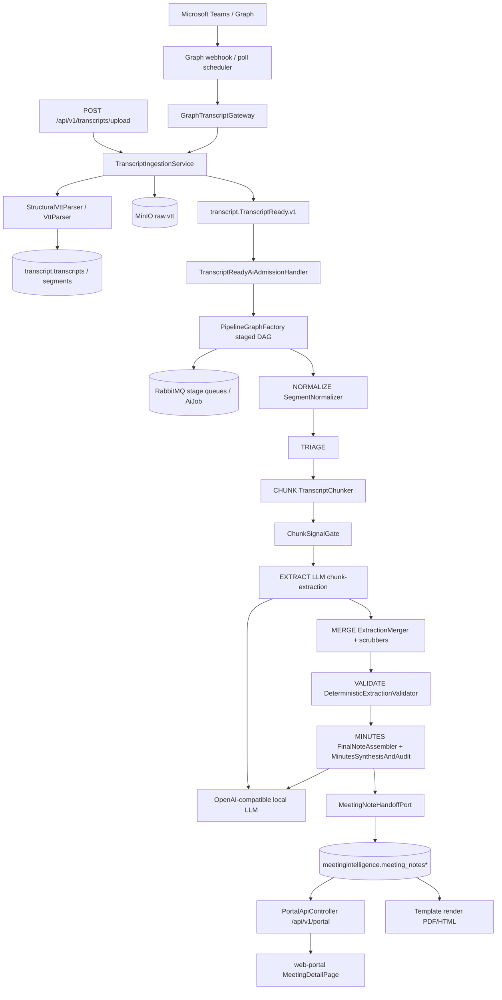

# NanobaseAI EasyMeeting (Actenora) — Teknik Durum Raporu / ChatGPT Handoff

> **Ürün adı:** NanobaseAI EasyMeeting  
> **Kod tabanı / repo adı:** NanobaseAI-Actenora  
> **İnceleme tarihi:** 2026-08-03  
> **İnceleme türü:** Read-only (kaynak kod değiştirilmedi)  
> **Amaç:** Transcript/VTT girişinden tutanak, özet, karar, aksiyon, risk ve diğer çıktılara kadar mevcut sistemin eksiksiz teknik durumunu ChatGPT’ye aktarmak.

---

## İnceleme sınırları ve doğruluk notları

1. Hiçbir kaynak kodu değiştirilmedi; yeni özellik eklenmedi.
2. Secret / token / parola / kişisel veri rapora yazılmadı; yalnızca ortam değişkeni **adları** verildi.
3. Kodda olmayan özellik “var” diye anlatılmadı.
4. Emin olunamayan noktalar **doğrulanamadı** olarak işaretlendi.
5. README ile kod çelişkileri ayrıca belirtildi.
6. Durum etiketleri: **planlandı / kısmen uygulanmış / uygulanmış fakat çağrılmıyor / aktif olarak kullanılıyor / ölü kod**.
7. **Working tree uyarısı:** `main` üzerinde commit edilmemiş AI-processing değişiklikleri vardır (`CrossTypeMeetingItemSubsumer`, `ActionTitleEvidenceBackfiller`, terminology/register normalizer’lar, prompt düzenlemeleri). Bu rapor **mevcut working tree + HEAD** birleşimini yansıtır; uncommitted parçalar açıkça işaretlenir.

---

# 1. REPOSITORY VE ÇALIŞMA ORTAMI

| Alan | Değer |
|------|--------|
| Repository tam yolu | `/Users/msancar/Documents/GitHub/NanobaseAI-Actenora` |
| Aktif branch | `main` |
| Son commit hash | `f9c699f4753d7017d64aede84c6ee7da056a5f66` |
| Son commit mesajı | `vcvcx` |
| `git status` | Birçok `modules/ai-processing` dosyası **modified**; subsumer/backfiller/normalizer + testleri **untracked** |
| Ana diller | Java 21, TypeScript/React, Python (ai-orchestrator), SQL (Flyway) |
| Frameworkler | Spring Boot 3.4.5, Spring Modulith 1.3.5, Vite + React 19, FastAPI (health-only) |
| Build sistemi | Maven (`mvnw`), Make, pnpm, uv |
| Paket yöneticileri | Maven, pnpm, uv |
| Çalıştırma | `make run` → `scripts/run-local`; backend: `./mvnw -pl apps/platform-backend -am spring-boot:run` |
| Docker / Compose | `infrastructure/compose/docker-compose.yml` (+ prod-like, portal-server override) |
| Systemd | Yok; deploy Compose + nginx (`systemctl reload nginx` yalnızca nginx) |
| Backend | `apps/platform-backend` (tek Spring Boot monolit) |
| Frontend | `apps/web-portal` |
| Teams app | `apps/teams-meeting-app` |
| Worker / bağımsız servis | In-process AI worker; `services/*` reserved/boş; compose `transcript-worker` yolu kırık |
| Veritabanı | PostgreSQL (pgvector:pg16), schema-per-module Flyway |
| Cache | Redis coordination (`ACTENORA_REDIS_COORDINATION_ENABLED`, default local: false) |
| Queue | RabbitMQ + transactional outbox/inbox (`ACTENORA_MESSAGING_MODE`, default local: inmemory) |
| LLM | Local OpenAI-compatible (`ACTENORA_AI_PROVIDER_BASE_URL`); cloud fallback yok |
| Transcript entegrasyonu | Microsoft Graph poll + webhook + manuel `.vtt` upload |

### Ortam değişkenleri (yalnızca adlar)

`ACTENORA_ENV`, `LOG_LEVEL`, `SPRING_PROFILES_ACTIVE`, `PLATFORM_BACKEND_PORT`, `WEB_PORTAL_PORT`, `TEAMS_APP_PORT`, `AI_ORCHESTRATOR_HOST`, `AI_ORCHESTRATOR_PORT`, `ACTENORA_AUTH_MODE`, `ACTENORA_PORTAL_AUTH_MODE`, `ACTENORA_ENTRA_ISSUER_URI`, `ACTENORA_ENTRA_AUDIENCE`, `ACTENORA_CORS_ALLOWED_ORIGINS`, `VITE_API_MODE`, `VITE_API_BASE_URL`, `VITE_PORTAL_AUTH_MODE`, `VITE_ENTRA_CLIENT_ID`, `VITE_ENTRA_TENANT_ID`, `VITE_ENTRA_API_SCOPE`, `VITE_IDENTITY_ENTRA_OID`, `VITE_IDENTITY_ENTRA_TID`, `VITE_IDENTITY_EMAIL`, `VITE_IDENTITY_DISPLAY_NAME`, `VITE_IDENTITY_GLOBAL_ADMIN`, `VITE_NANOBI_*`, `ACTENORA_PERSISTENCE_MODE`, `ACTENORA_MESSAGING_MODE`, `ACTENORA_REDIS_COORDINATION_ENABLED`, `ACTENORA_OBJECT_STORAGE_ENABLED`, `ACTENORA_AI_PROVIDER_*`, `ACTENORA_AI_PIPELINE_MODE`, `ACTENORA_AI_FINALIZATION_*`, `ACTENORA_AI_WORKER_*`, `ACTENORA_AI_ROUTING_*`, `ACTENORA_MEETING_SIGNAL_GATE_*`, `ACTENORA_MEETING_QUALITY_*`, `ACTENORA_MEETING_SPEECH_DICTIONARY_VERSION`, `ACTENORA_KNOWLEDGE_EMBEDDING_*`, `ACTENORA_MICROSOFT_GRAPH_*`, `MICROSOFT_*`, `TEAMS_RECONCILE_*`, `POSTGRES_*`, `RABBITMQ_*`, `REDIS_*`, `OBJECT_STORAGE_*`, `MAIL_*`, `MAILHOG_*`, `OTEL_*`, `LLM_BASE_URL`, `QWEN_BASE_URL`, `NANOBASEAI_INTELLIGENCE_BASE_URL`, `ACTENORA_DELIVERY_*`, `ACTENORA_PORTAL_*`, `ACTENORA_RATE_LIMIT_*`, `ACTENORA_SIGNED_URL_*`, `ACTENORA_AUDIT_RETENTION_DAYS`.

### Üst dizin yapısı

| Dizin | Rol |
|-------|-----|
| `apps/` | `platform-backend`, `web-portal`, `teams-meeting-app`, `ai-orchestrator` |
| `modules/` | 16 bounded-context Maven modülü |
| `packages/` | api/event contracts, observability, test-support |
| `infrastructure/` | compose, postgres, rabbitmq, redis, minio, otel, k8s stubs |
| `docs/` | ADR, architecture, operations, reviews |
| `artifacts/` | faz raporları, security scan çıktıları |
| `scripts/` | bootstrap, run-local, deploy, eval suite |
| `services/` | reserved / boş (README only) |
| `tmp/` | lokal eval VTT’leri (paketlenmiyor) |

### README ↔ kod çelişkileri

1. README: “AI process = Python FastAPI (`ai-orchestrator`)” → orchestrator **yalnızca health/readiness**; chat/completions **platform-backend → OpenAI-compatible LLM**.
2. README: “14 bounded contexts” → Maven’de **`notification`** de var; bazı docs/bands bunu saymıyor.
3. Compose `transcript-worker` profili `services/transcript-worker/Dockerfile` bekliyor → **dizin yok**.
4. Local compose infra ayağa kalksa bile varsayılan `ACTENORA_PERSISTENCE_MODE` / `MESSAGING_MODE` = **inmemory**.

---

# 2. YÖNETİCİ ÖZETİ

1. Sistem Microsoft Teams transcript’lerini (Graph poll/webhook veya manuel `.vtt`) alıp yapılandırılmış toplantı çıktısı ve tutanak taslağı üretir.
2. Desteklenen kaynak: **Teams Graph VTT** + **manuel VTT upload**.
3. Girdi: WebVTT (`.vtt`); max ~25 MB upload (`VttUploadValidator.DEFAULT_MAX_BYTES`).
4. Çıktılar: topics, decisions, actionItems, risks, openQuestions, commitments, issues, proposals, importantFacts, executive summary; portalda not + ledger + PDF/HTML.
5. LLM: chunk extraction (zorunlu yol); finalization’da varsayılan **editorial summary** (1 bounded call); `full` modda synthesis + evidence audit.
6. Deterministik katman: VTT parse, noise drop, chunking, ChunkSignalGate, speech-act scrub, action post-process, merge, schema/evidence validate, FinalNoteAssembler.
7. Üretime yakın: ingest, staged job DAG, local LLM adapter, MI handoff, portal BFF, PDF render, Graph (feature-flag).
8. Deneysel/tamamlanmamış: extracted workers, FULL synthesis kalitesi, semantic speech-act (no-op), gold eval suite eksikliği, uncommitted kalite patch’leri.
9. Kalite riskleri: status-quo/filler false positive, cross-type leakage, fixture’a özel regex’ler, FINAL truncation → fallback, `full` modda yeni madde üretme riski.
10. Performans: CPU local 35B, uzun transcript’te çok chunk + uzun timeout; gate token tasarrufu yapar.
11. Teknik borç: brittle TR regex sözlükleri; `final-minutes.schema.json` item şemaları gevşek; merge prompt’u `final-minutes.v1.txt` ile seed’lenmiş; legacy vs staged dual path.
12. Nihai tutanak: `FinalNoteAssembler` + `MinutesSynthesisAndAudit` → `MeetingNoteHandoffPort` → `meetingintelligence.*` → portal `MeetingDetailPage` + template PDF.
13. Model rolleri: `FAST_EXTRACTION`, `QWEN27_FINAL`, `VALIDATION` — **BALANCED yok**.
14. Cloud LLM fallback: **yok (tasarım gereği)**.
15. Bu oturumda unit test: transcript 48 PASS; ai-processing 249/250 (1 FAIL, WIP ile ilişkili).

---

# 3. UÇTAN UCA MİMARİ



### Tek toplantı — sıra numaralı akış

1. **Girdi:** Graph notification / poll veya multipart VTT.  
   **İşleyen:** `TeamsTranscriptIngestService.pollMeeting` / `TranscriptController.upload` → `TranscriptIngestionService`.  
   **Çıktı:** parse edilmiş segmentler + object storage key.  
   **Hata:** `MALFORMED_VTT`, `EMPTY_FILE`, `FILE_TOO_LARGE` → domain exception; AI başlamaz.  
   **Sonraki:** `TranscriptReady` event.

2. **Girdi:** Ready event.  
   **İşleyen:** `TranscriptReadyAiAdmissionHandler` → `PipelineGraphFactory.admitFromTranscriptReady`.  
   **Çıktı:** staged `AiJob` grafiği.  
   **Hata:** admission/idempotency çakışması → duplicate job engeli.  
   **Sonraki:** worker poll.

3. **NORMALIZE:** `SegmentNormalizer.normalize` — low-signal drop, terminology, attribution strip.  
   **Hata:** tümü noise ise fallback “hepsini tut”.  
   **Sonraki:** TRIAGE.

4. **TRIAGE:** erken çıkış veya full path (`expandAfterTriageFullPath`).  
   **Doğrulanamadı:** triage LLM çıktı şemasının her ortamda aynı runtime davranışı (config’e bağlı).

5. **CHUNK:** `TranscriptChunker` — ~3500/4500 token, overlap 250.  
   **Sonraki:** EXTRACT×N.

6. **EXTRACT:** `ChunkExtractionService.extract` → gate; skip ise boş bundle + `SKIPPED_LOW_SIGNAL`; değilse LLM.  
   **Hata:** JSON/schema → repair/retry; kalıcı chunk fail izole; hepsi fail → job fail.  
   **Sonraki:** MERGE barrier.

7. **MERGE + post:** `ExtractionMerger` → `ProposalCuePostProcessor` → `CrossTypeMeetingItemScrubber` → `CrossTypeConsistencyAuditor` → `ActionPostProcessingPipeline` → `CrossTypeMeetingItemSubsumer` (working tree).  
   **Sonraki:** VALIDATE.

8. **VALIDATE:** `DeterministicExtractionValidator` (evidence allowlist).  
   **Hata:** validation fail → pipeline exception / job fail veya manual-review flag’leri.

9. **MINUTES:** `FinalNoteAssembler.assemble` + `MinutesSynthesisAndAudit.finalizeMinutes` (default **EDITORIAL**).  
   **Hata:** LLM fail → deterministic draft + fallback flags/confidence cap.  
   **Sonraki:** enrich/recover/action post/subsume/confidence policy → handoff.

10. **Handoff:** `MeetingIntelligenceHandoffAdapter.handoff` → MI tables.  
    **Sonraki:** portal GET note; kullanıcı düzenleme/onay; PDF render/delivery.

---

# 4. MODÜL ENVANTERİ

| Modül | Dosya yolu | Sorumluluk | Kim çağırıyor? | Kimi çağırıyor? | Aktif mi? | Testi var mı? |
|-------|------------|------------|----------------|-----------------|-----------|---------------|
| Transcript ingest | `modules/transcript/.../TranscriptIngestionService.java` | VTT al, parse, sakla, event | Controller / Teams ingest | VttParser, storage, outbox | Aktif | Evet |
| Teams Graph | `modules/microsoft-connection` + `TeamsTranscriptIngestService` | VTT indir | Scheduler/webhook | Graph API, TranscriptApi | Flag’li aktif | Kısmen |
| VTT parser | `modules/transcript/.../parsing/VttParser.java` | Cue/speaker/timestamp | StructuralVttParser | — | Aktif | Evet |
| Speaker resolve | `modules/transcript/.../SpeakerResolver.java` | Dictionary eşleme | Normalization | TenantDictionary | Aktif | Kısmen |
| Segment normalize | `ai-processing/.../SegmentNormalizer.java` | Pipeline giriş temizliği | Extraction / NormalizeExecutor | NoisePatterns, Terminology | Aktif | Evet |
| Chunking | `TranscriptChunker.java` | Token pencereleri | Pipeline | TokenEstimator | Aktif | Evet |
| ChunkSignalGate | `.../signal/ChunkSignalGate.java` | Düşük sinyal skip | ChunkExtractionService | FeatureExtractor, Classifier | Aktif (prod) | Evet |
| Extraction pipeline | `ExtractionPipelineService.java` | Legacy monolith | mode=legacy / LEGACY | Tüm post-process | Kill-switch aktif | Evet |
| Staged DAG | `PipelineGraphFactory`, `DefaultStageExecutors` | Default pipeline | Admission + worker | Stage executors | **Default aktif** | Evet |
| Action post | `ActionPostProcessingPipeline.java` | Aksiyon temizliği | Legacy + staged | Dedup, date, owner, backfiller | Aktif | Evet (1 fail WIP) |
| Cross-type scrub | `CrossTypeMeetingItemScrubber` + `MeetingItemPolicy` | Speech-act filtre | Merge sonrası | HybridSpeechActClassifier | Aktif | Evet |
| Cross-type subsume | `CrossTypeMeetingItemSubsumer.java` | D⊃A⊃C | Pipeline (untracked) | Jaccard/core | Working tree aktif | Evet |
| Final assemble | `FinalNoteAssembler.java` | Deterministik draft | Minutes | — | Aktif | Evet |
| Minutes finalize | `MinutesSynthesisAndAudit.java` | Editorial/full/deterministic | MinutesExecutor / legacy | LLM | Aktif | Evet |
| Prompt registry | `InMemoryPromptRegistry.java` | Prompt seed/version | Pipeline | classpath prompts | Aktif | Evet |
| Model runtime | `LocalProviderModelRuntimeAdapter`, `RoleAwareModelRuntimePort` | LLM çağrı | Pipeline | OpenAI-compatible provider | Aktif | Evet |
| AI jobs | `AiJobInferenceExecutor` | Worker | Scheduler | Staged/legacy | Aktif | Evet |
| MI handoff | `MeetingIntelligenceHandoffAdapter` | Not persist | Minutes complete | MI domain | Aktif | Evet |
| Portal API | `PortalApiController` | BFF | web-portal | MI/meeting/transcript | Aktif | Kısmen |
| Portal UI | `apps/web-portal` | Ekranlar | Kullanıcı | Portal API | Aktif | JS unit |
| Delivery/PDF | `modules/delivery`, `modules/template` | HTML/PDF | Approval/delivery | openhtmltopdf | Aktif | Evet |
| Audit | `modules/audit` | Audit events | Platform | — | Aktif | Kısmen |
| Ops telemetry | `modules/operations` | Queue/DLQ/metrics UI | Ops page | — | Aktif | Kısmen |

Alan eşlemeleri (istenilen isim → gerçek bileşen):

- Transcript ingestion → `TranscriptIngestionService`
- Teams entegrasyonu → `microsoft-connection` + Graph webhook/poll
- VTT/Speaker parser → `VttParser`, `SpeakerResolver`
- Metin normalizasyonu → `TranscriptNormalizer`, `SegmentNormalizer`, `MeetingTerminologyNormalizer` (WIP)
- Chunking / ChunkSignalGate → `TranscriptChunker`, `ChunkSignalGate`
- Extraction / synthesis → staged executors + `MinutesSynthesisAndAudit`
- Decision/Action/Risk/Facts/OQ/Topics/Commitments → tek chunk extraction şeması + post-process
- Status-quo → prompt + `MeetingNoisePatterns` + speech-act rules + scrubber
- Hallucination → evidence grounding + audit (FULL) + editorial “do not add”
- Dedup / similarity / merge → `ExtractionMerger`, `ActionDeduplicator`, subsumer
- JSON repair / retry / timeout / fallback → `LimitedJsonRepair`, `PartialExtractionJsonRecovery`, `RetryClassifier`, provider/job retry, deterministic minutes fallback
- Persistence / API / Frontend / Export / Auth / Tenant / Audit / Telemetry → ilgili modüller (yukarıdaki tablo)

---

# 5. TRANSCRIPT VE VTT İŞLEME

1. **Nasıl geliyor?** Graph poll (`TeamsTranscriptPollScheduler` + `TeamsTranscriptIngestService`) ve/veya Graph webhook (`MicrosoftGraphWebhookController` → poll work) ve/veya manuel upload.
2. **Yöntem:** Üçü de kodda var; Graph `actenora.microsoft-graph.enabled` / `ACTENORA_MICROSOFT_GRAPH_ENABLED` ile açılır.
3. **Dosya türü:** `.vtt`; MIME `text/vtt|text/plain|application/octet-stream`; max 25 MB.
4. **Parse:** `VttParser.parse` (`modules/transcript/.../VttParser.java` ~L42+).
5. **Timestamp:** `HH:MM:SS.mmm -->` ve kısa `MM:SS.mmm`; bozuk → issue + cue skip; end&lt;start → skip.
6. **Speaker:** `<v Name>` veya `Name: text` (`looksLikeSpeaker`).
7. **Aynı isim:** `SpeakerResolver` dictionary’de birden fazla match → `ambiguous` (otomatik finalize yok). Homonym disambiguation ötesi **doğrulanamadı**.
8. **Speaker yok:** `speaker=null` segment; LLM’e isimsiz satır gider.
9. **Çok satırlı cue:** Aynı cue bloğunda `\n` ile birleştirilir.
10. **Boş/tekrar/bozuk:** boş content issue+skip; exact duplicate key remove; overlap issue (segment silinmez).
11. **TR/encoding:** UTF-8; BOM strip; whitespace normalizer.
12. **Noktalama düzeltme:** Genel punctuation repair yok; whitespace collapse var.
13. **ASR düzeltme:** `MeetingTerminologyNormalizer` (Mayusque→MySQL, poscree→PostgreSQL vb.; untracked/WIP) + prompt kuralları.
14. **Tekrar konuşma:** VTT exact-dup; semantic repetition signal gate’te skor düşürür.
15. **Gürültü:** `MeetingNoisePatterns.isLowSignalSegment` + gate UI noise.
16. **Uzun toplantı:** token chunking + overlap 250 + staged parallel extract.
17. **Bağlam kaybı önlemi:** overlap; continuation-aware gate; marker-aware boundary.
18. **Speaker/timestamp LLM’e:** `TranscriptChunk.joinedContent` speaker ekler (`Name: text`); **timestamp satırı joinedContent’te yok**; segment id evidence olarak gider.
19. **Max:** chunk max 4500 token; upload 25 MB; operational ctx 16384.
20. **Token:** `ApproximateTokenEstimator` ≈ `(length + 3) / 4`.

### Örnek dönüşüm (anonim fixture)

Kaynak: `modules/transcript/src/test/resources/fixtures/valid.vtt`

```text
Ham VTT:
WEBVTT
00:00:01.000 --> 00:00:04.000
<v Alice>Hello team, welcome to the sync.

→ Parse cue: speaker=Alice, start=1000ms, end=4000ms,
  content="Hello team, welcome to the sync."

→ Normalize (pipeline): low-signal değilse içerik korunur; markup strip + terminology rewrite

→ Chunk joinedContent:
Alice: Hello team, welcome to the sync.
Bob: Thanks Alice. Let's review the agenda.

→ LLM user prompt: chunk-extraction.v1.txt içinde {{chunk}} = joinedContent;
   {{evidenceSegmentIds}} = segment UUID listesi;
   system = system-meeting-analyst.v2.txt (+ dil ek kuralları)
```

Türkçe zengin örnek: `modules/ai-processing/src/test/resources/aiprocessing/eval/01_15dk_daily_standup.vtt` (sentetik stand-up; status-quo ve “Henüz karar değil” içeren).

---

# 6. LLM MİMARİSİ VE MODEL ENTEGRASYONU

| Aşama | Çağıran | Model/alias | Endpoint | Prompt | Input | Output schema | Temp | Max token | Timeout | Retry | Fallback |
|-------|---------|-------------|----------|--------|-------|---------------|------|-----------|---------|-------|----------|
| Chunk extraction | `ExtractionPipelineService` / `ExtractChunkExecutor` | `FAST_EXTRACTION` → `ACTENORA_AI_PROVIDER_FAST_EXTRACTION_SERVED_MODEL_ID` | `{BASE_URL}/v1/chat/completions` (maskeli) | system v2 + chunk-extraction.v1 | chunk+meta | `extraction-output.schema.json` | 0.1 | 6144 | request/provider | in-chunk + provider max-attempts 5 | gate skip / empty bundle; chunk izolasyonu |
| Editorial summary | `MinutesSynthesisAndAudit.editorialFinalize` | `QWEN27_FINAL` / FINAL_NOTE | aynı | editorial-summary.v1 | validatedMinutes JSON | `editorial-summary.schema.json` | 0.1 | 768 (config) | finalization-timeout (1800s) | provider | deterministic summary |
| Full synthesis | `synthesize` (mode=FULL) | FINAL | aynı | final-minutes.v1 | candidates | `final-minutes.schema.json` | 0.1 | 8192 | timeout | provider | deterministic draft + SYNTHESIS_FALLBACK |
| Evidence audit | FULL path | VALIDATION/FINAL | aynı | evidence-audit.v1 | candidates | `evidence-audit.schema.json` | 0.1 | 2048 | timeout | provider | AUDIT_FALLBACK |
| Meeting Q&A | Portal productivity | MEETING_QUESTION | aynı | `portal/prompts/meeting-question.v1.txt` | evidence | (portal) | doğrulanamadı | 768 | 45s | doğrulanamadı | — |

### Ek cevaplar

- Tek model mi? Runtime’da genelde aynı served-model iki role map edilebilir; roller ayrı.
- FAST/BALANCED/FINAL? `FAST_EXTRACTION`, `QWEN27_FINAL`, `VALIDATION` — **BALANCED yok**.
- Model seçimi: `TaskRoleMapping` + `RoleAwareModelRuntimePort` + MultiModelRouter.
- Local: evet (OpenAI-compatible).
- Streaming: generation param `stream=true`.
- JSON mode / JSON Schema: `json_schema` strict tercih; yoksa `json_object`.
- Function calling: **kullanılmıyor** (doğrulanan yol).
- Parse edilemezse: repair + partial recovery + retry.
- Truncation: budgets yorumları + finish_reason=length → SYNTHESIS_FALLBACK (FULL).
- Timeout retry: provider/job seviyesinde; aynı role/provider yoluna.
- LLM yoksa: `MODEL_UNAVAILABLE` requeue; minutes deterministic fallback.
- Boş vs hata: gate skip flags vs PipelineException categories.
- Kullanıcı hatası: AI progress / note review flags; sessiz empty chunk merge mümkün.
- Transcript LLM cache: **bulunamadı**.
- Prompt/model version: `meeting_note_versions.prompt_version_id`, `model_id`; routing attempt history.
- Audit edilebilir mi: evet, version + attempt/routing kayıtları ile.

---

# 7. KULLANILAN PROMPTLAR

| Dosya | Prompt id / version | Çağıran | Aşama | Aktif? | Alternatif |
|-------|---------------------|---------|-------|--------|------------|
| `system-meeting-analyst.v2.txt` | system prefix | `ExtractionPromptRules` | tüm LLM | **Aktif** | v1 fallback |
| `system-meeting-analyst.v1.txt` | legacy | load fallback | — | yedek | v2 |
| `chunk-extraction.v1.txt` | `meeting.chunk-extraction` / `pv-meeting-chunk-extraction-v2` | registry + extract | EXTRACT | **Aktif** | v1 seed aynı template |
| `editorial-summary.v1.txt` | `pv-meeting-editorial-summary-v1` | Minutes EDITORIAL | MINUTES | **Default** | — |
| `final-minutes.v1.txt` | `meeting.final-note` + merge seed | FULL + registry | FULL / merge template | FULL’de aktif | — |
| `evidence-audit.v1.txt` | `meeting.validation` | FULL audit | FULL | FULL’de | — |
| `portal/.../meeting-question.v1.txt` | meeting-question.v1 | Portal Q&A | ayrı | Portal feature | — |

**Dinamik alanlar (chunk):** `{{meetingTitle}}`, `{{meetingDate}}`, `{{participants}}`, `{{outputLanguage}}`, `{{outputLanguageCode}}`, `{{evidenceSegmentIds}}`, `{{chunk}}`.

### Prompt davranış analizi

- Karar: açık karar; öneri ≠ karar; status-quo / “yeni karar yok” **hiçbir alana konmamalı**.
- Status-quo: atılmalı (prompt + speech-act + noise regex).
- Aksiyon vs niyet: “yapabiliriz” karar/görev değil; “yapacağım” commitment olabilir.
- Owner/tarih yoksa null; dueAt doldurma.
- Risk vs sorun: ayrı `risks` / `issues`; mitigation/likelihood isteniyor.
- Important facts: ölçüm/oran/hata gözlemi; geçici durum taşıma.
- Cross-type kaçış: prompt yasaklıyor; runtime scrubber destekliyor — leakage hâlâ mümkün.
- Boş liste: şema array’leri zorunlu ama boş olabilir.
- FULL prompt madde 6 “boş kalmasın” **doldurmaya teşvik** edebilir (kalite riski).
- Filler teşviki: chunk/system prompt filler’ı yasaklıyor; FULL §6 riskli.

### Aktif promptların TAM METNİ

#### `system-meeting-analyst.v2.txt`

```text
Sen, kurumsal toplantı konuşmalarını analiz eden kıdemli bir toplantı analisti ve kurumsal raportörsün.

Görevin, yalnızca sana verilen toplantı verilerine dayanarak doğru, kanıtlanabilir, profesyonel ve yönetici seviyesinde toplantı çıktıları üretmektir.

TEMEL KURALLAR
1. Yalnızca verilen toplantı konuşması, toplantı metadata'sı ve önceki aşamalardan gelen doğrulanmış bilgiler üzerinden çalış.
2. Verilmeyen bilgileri tahmin etme, tamamlama veya uydurma.
3. Bir karar, görev, taahhüt, risk veya tarih açıkça ifade edilmemişse kesin bilgi olarak yazma.
4. Belirsiz bilgileri null olarak işaretle.
5. Her önemli çıkarım için evidenceSegmentIds koru; kanıt yoksa öğe üretme.
6. Aynı konuyu çoğaltma; öneriyi karar olarak sunma.
7. “Yapabiliriz/bakalım/değerlendirelim” kesin görev veya karar değildir.
8. “Yapacağım/hazırlayacağım/göndereceğim/ekleyeceğim” açık self-commitment olabilir; owner = konuşmacı.
9. Owner veya dueDate açık değilse null bırak; konuşmacıyı yalnızca açık birinci tekil taahhütte owner say.
9b. Birden fazla owner+iş içeren cümleyi ayrı actionItems olarak ayır; “Aksiyon kaydı:” önekini text’e yazma.
9c. relativeDate’i verbatim koru; dueAt uydurma.
9d. Her actionItems.text tek başına anlaşılır olmalı: görevin nesnesini ve kapsamını yakın konuşma
    bağlamından taşı; “düzeltmeyi yapacak”, “bunu tamamlayacak” gibi bağlamsız ifadeler üretme.
10. Status-quo / dolgu hiçbir çıktı kategorisine eklenmez: “mevcut kararı değiştirmiyoruz”, “yeni karar yok”,
    “sadece bağlam”, ekran/mikrofon/liste senkronu, “bu noktayı açalım”, not alma talimatı, kapanış meta.
    Bunları decisions, importantFacts, openQuestions, topics, commitments, actions veya proposals’a yazma; tamamen at.
10b. “Henüz karar değil” / açık öneri → proposals. Yalnız konuşmayı sürdürme ifadesi → at (proposal değil).
10c. Somut fakat seçilmemiş çözüm alternatiflerini proposals altında koru. Sonradan açıkça seçilen
     alternatif karar olur; aynı alternatifin proposal kopyasını üretme.
11. Risk mitigation/likelihood konuşulduysa koru; sentez aşamasında düşürme.
12. Tüm kullanıcıya görünen metin alanlarını (purpose, executiveSummary, topics, decisions, actionItems, risks, commitments, openQuestions ve benzeri) YALNIZCA {{outputLanguage}} dilinde yaz (dil kodu: {{outputLanguageCode}}). Kullanıcı dilinin dışında hiçbir ifade, meta cümle veya boş-özet metni üretme.
12b. Çok maddeli metinlerde okunabilirlik: maddeleri `;` ile tek satırda birleştirme; her maddeyi `1. ` / `2. ` ile yeni satıra yaz; sıra numarası metinden ayrılıp alt satıra düşmesin.
13. Yalnızca geçerli JSON döndür (markdown/yorum yok).
14. confidence: 0.90–1.00 açık; 0.75–0.89 büyük ölçüde açık; 0.50–0.74 dolaylı; <0.50 sunma/manuel inceleme.
15. Doğrulanmış ölçüm, oran, adet, hata gözlemi ve deney sonuçlarını importantFacts altında koru.
    Açıkça geçici mevcut durum veya karar olmadığı söylenen davranış ifadelerini burada çoğaltma.

OUTPUT SCHEMA
Respond with a single JSON object whose keys match the published extraction schema (stable key order).
```

#### `system-meeting-analyst.v1.txt` (yedek)

```text
Sen, kurumsal toplantı konuşmalarını analiz eden kıdemli bir toplantı analisti ve kurumsal raportörsün.

Görevin, yalnızca sana verilen toplantı verilerine dayanarak doğru, kanıtlanabilir, profesyonel ve yönetici seviyesinde toplantı çıktıları üretmektir.

TEMEL KURALLAR
1. Yalnızca verilen toplantı konuşması, toplantı metadata'sı ve önceki aşamalardan gelen doğrulanmış bilgiler üzerinden çalış.
2. Verilmeyen bilgileri tahmin etme, tamamlama veya uydurma.
3. Bir karar, görev, taahhüt, risk veya tarih açıkça ifade edilmemişse kesin bilgi olarak yazma.
4. Belirsiz bilgileri null olarak işaretle.
5. Her önemli çıkarım için evidenceSegmentIds koru; kanıt yoksa öğe üretme.
6. Aynı konuyu çoğaltma; öneriyi karar olarak sunma.
7. “Yapabiliriz/bakalım/değerlendirelim” kesin görev veya karar değildir.
8. “Yapacağım/hazırlayacağım/göndereceğim” commitment olabilir.
9. Owner veya dueDate açık değilse null bırak; konuşmacıyı otomatik owner sayma.
10. Tüm kullanıcıya görünen metin alanlarını (purpose, executiveSummary, topics, decisions, actionItems, risks, commitments, openQuestions ve benzeri) YALNIZCA {{outputLanguage}} dilinde yaz (dil kodu: {{outputLanguageCode}}). Kullanıcı dilinin dışında hiçbir ifade, meta cümle veya boş-özet metni üretme.
10b. Çok maddeli metinlerde okunabilirlik: maddeleri `;` ile tek satırda birleştirme; her maddeyi `1. ` / `2. ` ile yeni satıra yaz; sıra numarası metinden ayrılıp alt satıra düşmesin.
11. Yalnızca geçerli JSON döndür (markdown/yorum yok).
12. confidence: 0.90–1.00 açık; 0.75–0.89 büyük ölçüde açık; 0.50–0.74 dolaylı; <0.50 sunma/manuel inceleme.
```

#### `chunk-extraction.v1.txt`

```text
Aşağıdaki toplantı konuşması parçasını analiz et.
Bu aşamada toplantı tutanağı yazma. Yalnızca yapılandırılmış aday bilgiler çıkar.

MEETING_TITLE: {{meetingTitle}}
MEETING_DATE: {{meetingDate}}
PARTICIPANTS: {{participants}}
OUTPUT_LANGUAGE: {{outputLanguage}} ({{outputLanguageCode}})
Allowed evidenceSegmentIds: {{evidenceSegmentIds}}

MEETING_CONVERSATION_CHUNK:
{{chunk}}

GÖREV
Konular (+kısa özet), açık kararlar (+gerekçe/status), aksiyonlar (+ownerType/priority/relativeDate),
taahhütler, issues, riskler (+likelihood/mitigation), açık sorular, proposals, importantFacts çıkar.
Öneriyi karar sayma (proposals'a koy). Sahibi/tarihi açık değilse null. Kanıtsız kayıt üretme.
Durum güncellemesi / tek konuşmacılı brifing olsa bile: kim neyi ne zamana bitirecek → commitments + actionItems;
katılım yokluğu, iletilmeyen takvim, belirsiz teslim → risks ve/veya openQuestions.
dueDate yalnızca konuşmada geçen tarih ifadesini aynen yaz (ISO uydurma); relativeDate kullanabilirsin.
dueAt alanını doldurma (takvim çözümlemesi backend'de yapılır).
Bir cümlede birden fazla owner+iş varsa her birini ayrı actionItems kaydı olarak döndür; tek satırda birleştirme.
Her actionItems.text tek başına anlaşılır olmalı; görevin nesnesini ve kapsamını yakın konuşma
bağlamından taşı, zamir veya “düzeltmeyi yapacak” gibi bağlamsız kısa ifadeler kullanma.
"Aksiyon kaydı:", "Aksiyon:", "Görev:" gibi söylem etiketlerini action text'e yazma.
Tarih ifadesini yalnızca ilgili owner clause'una bağla (Selin'in tarihi Can'a taşınmasın).
"Yapacağım/ekleyeceğim/göndereceğim" açık self-commitment ise commitments.owner = konuşmacı olabilir;
yalnızca konuşmacı olduğu için otomatik owner atama.
KARAR DEĞİL / DOLGU: "mevcut kararı değiştirmiyoruz", "yeni karar yok", "sadece bağlam paylaşımı",
ekran/mikrofon/UI operasyon, "bu noktayı açalım", not alma / kapanış meta cümleleri —
bunları decisions, importantFacts, openQuestions, topics, commitments, actions veya proposals
alanlarından HİÇBİRİNE koyma. Tamamen at.
PROPOSAL: "Henüz karar değil", "öneri olarak not ediyorum" veya açık öneri içeren ifadeleri
decisions'a koyma. Gerçek bir öneri içeriyorsa proposals'a ekle; yalnız konuşmayı sürdürme /
konu açma ifadesiyse tamamen at.
Somut fakat seçilmemiş çözüm alternatiflerini proposals altında koru; sonradan açıkça seçilen
alternatifi ayrıca proposal olarak çoğaltma.
Doğrulanmış ölçüm, oran, adet, hata gözlemi veya deney sonucu karar/aksiyon olmasa bile
importantFacts altında korunmalı. Açıkça geçici mevcut durum veya “karar değildir” diye
nitelenen davranış değişikliği ifadelerini importantFacts'a taşıma.
Riskte konuşulan mitigation/likelihood varsa mutlaka doldur (ör. "erken smoke", HIGH/MEDIUM/LOW).
Tüm metin alanlarını yalnızca {{outputLanguage}} dilinde yaz; kullanıcı dilinin dışında ifade üretme.
ASR/ürün adı: Mayusque/Moyusque → MySQL; konuşma dili “reçete” → gereksinim dokümanı (PRD yazma).
candidateId formatı: chunk-{n}-{type}-{seq} (ör. chunk-1-decision-01).

Aşağıdaki JSON şemasında yanıt ver (yalnızca JSON):
{
  "topics": [{"candidateId":null,"text":"","summary":null,"evidenceSegmentIds":[],"confidence":0.0}],
  "decisions": [{"candidateId":null,"text":"","rationale":null,"status":"DECIDED","evidenceSegmentIds":[],"confidence":0.0}],
  "actionItems": [{"candidateId":null,"text":"","owner":null,"ownerType":null,"dueDate":null,"relativeDate":null,"dueAt":null,"priority":null,"evidenceSegmentIds":[],"confidence":0.0}],
  "risks": [{"candidateId":null,"text":"","likelihood":null,"mitigation":null,"evidenceSegmentIds":[],"confidence":0.0}],
  "openQuestions": [{"candidateId":null,"text":"","evidenceSegmentIds":[],"confidence":0.0}],
  "commitments": [{"candidateId":null,"text":"","owner":null,"evidenceSegmentIds":[],"confidence":0.0}],
  "issues": [{"candidateId":null,"text":"","evidenceSegmentIds":[],"confidence":0.0}],
  "proposals": [{"candidateId":null,"text":"","evidenceSegmentIds":[],"confidence":0.0}],
  "importantFacts": [{"candidateId":null,"text":"","evidenceSegmentIds":[],"confidence":0.0}],
  "normalizationIssues": [],
  "qualityFlags": [],
  "evidenceSegmentIds": [],
  "confidence": 0.0
}
```

#### `editorial-summary.v1.txt`

```text
Create only the executive summary for the validated meeting-minutes data in the user message.

The structured items are authoritative. Do not add, remove, merge, reinterpret, or contradict any
decision, action, owner, date, commitment, risk, proposal, question, fact, or evidence reference.
Do not infer information that is absent from the validated data.

Write an outcome-only summary: 1–2 key results, critical next steps, and watchouts if present.
Do not restate or enumerate the agenda/topics list. Do not dump every item.

The user message is a JSON object with outputLanguageCode, meetingTitle, and validatedMinutes.
Write in outputLanguageCode. Keep the summary concise, professional, standalone, and focused on
the most consequential validated outcomes. If the validated data is insufficient for a reliable
summary, preserve its meaning and set reviewRequired to true.

Return JSON only:
{
  "executiveSummary": "",
  "reviewRequired": false
}
```

#### `final-minutes.v1.txt`

```text
Aşağıdaki parça analizlerini birleştirerek profesyonel bir toplantı tutanağı veri modeli oluştur.
Yalnızca verilen aday bilgiler ve kanıt segment kimlikleri üzerinden çalış. Ham varsayım üretme.
Önceki toplantı bağlamını yalnızca süreklilik/taşıma (carry-over) için kullan; yeni karar/aksiyon uydurma.

MEETING_TITLE: {{meetingTitle}}
OUTPUT_LANGUAGE: {{outputLanguage}} ({{outputLanguageCode}})
PRIOR_MEETING_CONTEXT:
{{priorMeetingContext}}
CANDIDATE_JSON:
{{candidatesJson}}
ALLOWED_EVIDENCE_IDS: {{evidenceSegmentIds}}

GÖREVLER
1. Tekrarları birleştir; candidateId çakışmalarını çöz.
2. Öneri/karar ayrımını koru (proposals ≠ decisions). Status-quo dolgu (“mevcut kararı değiştirmiyoruz”,
   “yeni karar yok”, “sadece bağlam”), discussion prompt ve kapanış meta içeriğini decisions,
   importantFacts, openQuestions, topics veya commitments’e taşıma — tamamen çıkar.
   Karara dönüşmüş öneriyi proposals’ta tutma (aynı konu + aynı eylem + aynı kapsam).
3. confidence < 0.75 olan kritik öğeleri qualityFlags içine NEEDS_REVIEW olarak işaretle.
4. purpose ve executiveSummary dahil tüm metin alanlarını {{outputLanguage}} dilinde yaz; özet en fazla 150 kelime;
   kabul edilmemiş öneriyi karar gibi sunma. Özeti gerçek karar/aksiyon/risk sinyallerine ağırlık ver;
   ekran/mikrofon/UI dolgusunu özetleme. Kullanıcı dilinin dışında meta/İngilizce cümle üretme.
4b. Okunabilirlik: birden fazla gündem/karar/aksiyon/risk maddesini `;` ile tek satıra yığma. Her maddeyi
   yeni satırda numaralandır (`1. …`, `2. …`); sayım cümlelerini (`3 karar kaydedildi`) ayrı satıra yaz.
   Sıra numarası ile madde metni aynı satırda kalsın.
4c. Aksiyon metni tek başına anlaşılır olsun (kim + ne + nerede). “düzeltmeyi yapacak”, “başlığı düzeltecek”
   gibi jenerik ifadeler yazma. relativeDate/dueDate/dueAt adaydaysa koru; yoksa tarih uydurma.
   Söylem öneklerini (Aksiyon kaydı:) ve compound birleştirmeyi koruma — atomik aksiyonları birleştirme.
4d. Risk mitigation yalnızca kanıt segmentinde geçiyorsa doldur; uydurma.
4e. nextSteps yalnızca kanıtlı bir sonraki kontrol maddeleri olsun; açık soru/aksiyon uydurma.
4f. Karar–öneri çakışması modelde çözülemiyorsa qualityFlags’e UNRESOLVED_DECISION_PROPOSAL_CONFLICT ekle;
   çözüm post-process’te yapılır — çakışmayı sessizce yok sayma.
5. agendaTopics / nextSteps üret; kanıtsız öğeleri çıkar.
6. Adaylardaki commitments, actionItems, risks ve openQuestions boş kalmasın: özet içinde geçen taahhüt/aksiyon/risk/açık soruları ilgili dizilere taşı (yalnızca CANDIDATE_JSON + ALLOWED_EVIDENCE_IDS üzerinden).
7. Risk adaylarındaki likelihood ve mitigation alanlarını koru; boşaltma.
8. PRIOR_MEETING_CONTEXT içindeki açık görev/risk/soruları nextSteps veya openQuestions ile ilişkilendir; kanıt yoksa yeni karar üretme. RELATED_KNOWLEDGE yalnızca süreklilik ipucu olarak kullan.
9. reviewRequired=true yalnızca belirsiz/eksik kritik alan varsa.

Yalnızca şu JSON'u döndür:
{
  "meetingTitle": "",
  "purpose": "",
  "executiveSummary": "",
  "agendaTopics": [],
  "topics": [{"candidateId":null,"text":"","summary":null,"evidenceSegmentIds":[],"confidence":0.0}],
  "decisions": [{"candidateId":null,"text":"","rationale":null,"status":"DECIDED","evidenceSegmentIds":[],"confidence":0.0}],
  "actionItems": [{"candidateId":null,"text":"","owner":null,"ownerType":null,"dueDate":null,"relativeDate":null,"dueAt":null,"priority":null,"evidenceSegmentIds":[],"confidence":0.0}],
  "risks": [{"candidateId":null,"text":"","likelihood":null,"mitigation":null,"evidenceSegmentIds":[],"confidence":0.0}],
  "openQuestions": [{"candidateId":null,"text":"","evidenceSegmentIds":[],"confidence":0.0}],
  "commitments": [{"candidateId":null,"text":"","owner":null,"evidenceSegmentIds":[],"confidence":0.0}],
  "issues": [],
  "proposals": [],
  "importantFacts": [],
  "nextSteps": [],
  "reviewRequired": false,
  "qualityFlags": [],
  "evidenceSegmentIds": [],
  "confidence": 0.0
}
```

#### `evidence-audit.v1.txt`

```text
Her karar ve aksiyon maddesini kanıt segment kimlikleriyle karşılaştır.

OUTPUT_LANGUAGE: {{outputLanguage}} ({{outputLanguageCode}})
CANDIDATES_JSON:
{{candidatesJson}}
ALLOWED_EVIDENCE_IDS: {{evidenceSegmentIds}}

Her öğe için verdict döndür:
SUPPORTED | PARTIALLY_SUPPORTED | UNSUPPORTED | CONTRADICTED

UNSUPPORTED veya CONTRADICTED kayıtlar çıkarılacak.
PARTIALLY_SUPPORTED insan onayına gidecek.
reason alanını yalnızca {{outputLanguage}} dilinde yaz.

Yalnızca JSON:
{
  "audits": [
    {"type":"DECISION|ACTION_ITEM|RISK|COMMITMENT|OPEN_QUESTION","text":"","verdict":"SUPPORTED","reason":""}
  ]
}
```

---

# 8. JSON ŞEMALARI VE VERİ MODELLERİ

### Aktif LLM output JSON Schema — `extraction-output.schema.json` (tam)

```json
{
  "$schema": "https://json-schema.org/draft/2020-12/schema",
  "$id": "https://actenora.nanobase.ai/schemas/extraction-output.v1.json",
  "title": "MeetingChunkExtraction",
  "type": "object",
  "additionalProperties": false,
  "required": [
    "topics",
    "decisions",
    "actionItems",
    "risks",
    "openQuestions",
    "commitments",
    "qualityFlags",
    "evidenceSegmentIds",
    "confidence"
  ],
  "properties": {
    "topics": {
      "type": "array",
      "items": { "$ref": "#/$defs/topic" }
    },
    "decisions": {
      "type": "array",
      "items": { "$ref": "#/$defs/decision" }
    },
    "actionItems": {
      "type": "array",
      "items": { "$ref": "#/$defs/actionItem" }
    },
    "risks": {
      "type": "array",
      "items": { "$ref": "#/$defs/risk" }
    },
    "openQuestions": {
      "type": "array",
      "items": { "$ref": "#/$defs/evidencedText" }
    },
    "commitments": {
      "type": "array",
      "items": { "$ref": "#/$defs/commitment" }
    },
    "issues": {
      "type": "array",
      "items": { "$ref": "#/$defs/evidencedText" }
    },
    "proposals": {
      "type": "array",
      "items": { "$ref": "#/$defs/evidencedText" }
    },
    "importantFacts": {
      "type": "array",
      "items": { "$ref": "#/$defs/evidencedText" }
    },
    "normalizationIssues": {
      "type": "array",
      "items": { "type": "string" }
    },
    "qualityFlags": {
      "type": "array",
      "items": { "type": "string" }
    },
    "evidenceSegmentIds": {
      "type": "array",
      "items": { "type": "string", "minLength": 1 }
    },
    "confidence": {
      "type": "number",
      "minimum": 0,
      "maximum": 1
    }
  },
  "$defs": {
    "evidencedText": {
      "type": "object",
      "additionalProperties": false,
      "required": ["text", "evidenceSegmentIds"],
      "properties": {
        "candidateId": { "type": ["string", "null"] },
        "text": { "type": "string", "minLength": 1 },
        "evidenceSegmentIds": {
          "type": "array",
          "minItems": 1,
          "items": { "type": "string", "minLength": 1 }
        },
        "confidence": { "type": "number", "minimum": 0, "maximum": 1 }
      }
    },
    "topic": {
      "type": "object",
      "additionalProperties": false,
      "required": ["text", "evidenceSegmentIds"],
      "properties": {
        "candidateId": { "type": ["string", "null"] },
        "text": { "type": "string", "minLength": 1 },
        "summary": { "type": ["string", "null"] },
        "evidenceSegmentIds": {
          "type": "array",
          "minItems": 1,
          "items": { "type": "string", "minLength": 1 }
        },
        "confidence": { "type": "number", "minimum": 0, "maximum": 1 }
      }
    },
    "decision": {
      "type": "object",
      "additionalProperties": false,
      "required": ["text", "evidenceSegmentIds"],
      "properties": {
        "candidateId": { "type": ["string", "null"] },
        "text": { "type": "string", "minLength": 1 },
        "rationale": { "type": ["string", "null"] },
        "status": {
          "type": ["string", "null"],
          "enum": ["DECIDED", "PROPOSED", "DEFERRED", null]
        },
        "evidenceSegmentIds": {
          "type": "array",
          "minItems": 1,
          "items": { "type": "string", "minLength": 1 }
        },
        "confidence": { "type": "number", "minimum": 0, "maximum": 1 }
      }
    },
    "actionItem": {
      "type": "object",
      "additionalProperties": false,
      "required": ["text", "evidenceSegmentIds"],
      "properties": {
        "candidateId": { "type": ["string", "null"] },
        "text": { "type": "string", "minLength": 1 },
        "owner": { "type": ["string", "null"] },
        "ownerType": {
          "type": ["string", "null"],
          "enum": ["PERSON", "TEAM", "ROLE", "UNKNOWN", null]
        },
        "dueDate": { "type": ["string", "null"] },
        "relativeDate": { "type": ["string", "null"] },
        "dueAt": { "type": ["string", "null"] },
        "priority": {
          "type": ["string", "null"],
          "enum": ["HIGH", "MEDIUM", "LOW", null]
        },
        "evidenceSegmentIds": {
          "type": "array",
          "minItems": 1,
          "items": { "type": "string", "minLength": 1 }
        },
        "confidence": { "type": "number", "minimum": 0, "maximum": 1 }
      }
    },
    "risk": {
      "type": "object",
      "additionalProperties": false,
      "required": ["text", "evidenceSegmentIds"],
      "properties": {
        "candidateId": { "type": ["string", "null"] },
        "text": { "type": "string", "minLength": 1 },
        "likelihood": {
          "type": ["string", "null"],
          "enum": ["HIGH", "MEDIUM", "LOW", null]
        },
        "mitigation": { "type": ["string", "null"] },
        "evidenceSegmentIds": {
          "type": "array",
          "minItems": 1,
          "items": { "type": "string", "minLength": 1 }
        },
        "confidence": { "type": "number", "minimum": 0, "maximum": 1 }
      }
    },
    "commitment": {
      "type": "object",
      "additionalProperties": false,
      "required": ["text", "evidenceSegmentIds"],
      "properties": {
        "candidateId": { "type": ["string", "null"] },
        "text": { "type": "string", "minLength": 1 },
        "owner": { "type": ["string", "null"] },
        "evidenceSegmentIds": {
          "type": "array",
          "minItems": 1,
          "items": { "type": "string", "minLength": 1 }
        },
        "confidence": { "type": "number", "minimum": 0, "maximum": 1 }
      }
    }
  }
}
```

### `editorial-summary.schema.json` (tam)

```json
{
  "$schema": "https://json-schema.org/draft/2020-12/schema",
  "$id": "meeting.editorial-summary.v1",
  "type": "object",
  "additionalProperties": false,
  "required": ["executiveSummary", "reviewRequired"],
  "properties": {
    "executiveSummary": {
      "type": "string",
      "minLength": 1
    },
    "reviewRequired": {
      "type": "boolean"
    }
  }
}
```

### `final-minutes.schema.json` (tam)

```json
{
  "$schema": "https://json-schema.org/draft/2020-12/schema",
  "$id": "https://actenora.nanobase.ai/schemas/final-minutes.v1.json",
  "title": "FinalMeetingMinutes",
  "type": "object",
  "additionalProperties": false,
  "required": [
    "executiveSummary",
    "topics",
    "decisions",
    "actionItems",
    "risks",
    "openQuestions",
    "commitments",
    "qualityFlags",
    "evidenceSegmentIds",
    "confidence"
  ],
  "properties": {
    "meetingTitle": { "type": ["string", "null"] },
    "purpose": { "type": ["string", "null"] },
    "executiveSummary": { "type": "string", "minLength": 1 },
    "agendaTopics": {
      "type": "array",
      "items": { "type": "string" }
    },
    "topics": { "type": "array", "items": { "type": "object" } },
    "decisions": { "type": "array", "items": { "type": "object" } },
    "actionItems": { "type": "array", "items": { "type": "object" } },
    "risks": { "type": "array", "items": { "type": "object" } },
    "openQuestions": { "type": "array", "items": { "type": "object" } },
    "commitments": { "type": "array", "items": { "type": "object" } },
    "issues": { "type": "array", "items": { "type": "object" } },
    "proposals": { "type": "array", "items": { "type": "object" } },
    "importantFacts": { "type": "array", "items": { "type": "object" } },
    "nextSteps": {
      "type": "array",
      "items": { "type": "string" }
    },
    "reviewRequired": { "type": "boolean" },
    "qualityFlags": {
      "type": "array",
      "items": { "type": "string" }
    },
    "evidenceSegmentIds": {
      "type": "array",
      "items": { "type": "string", "minLength": 1 }
    },
    "confidence": {
      "type": "number",
      "minimum": 0,
      "maximum": 1
    }
  }
}
```

### `evidence-audit.schema.json` (tam)

```json
{
  "$schema": "https://json-schema.org/draft/2020-12/schema",
  "$id": "https://actenora.nanobase.ai/schemas/evidence-audit.v1.json",
  "title": "EvidenceAudit",
  "type": "object",
  "additionalProperties": false,
  "required": ["audits"],
  "properties": {
    "audits": {
      "type": "array",
      "items": {
        "type": "object",
        "additionalProperties": false,
        "required": ["type", "text", "verdict"],
        "properties": {
          "type": {
            "type": "string",
            "enum": ["DECISION", "ACTION_ITEM", "RISK", "COMMITMENT", "OPEN_QUESTION", "TOPIC", "ISSUE", "PROPOSAL", "IMPORTANT_FACT"]
          },
          "text": { "type": "string", "minLength": 1 },
          "verdict": {
            "type": "string",
            "enum": ["SUPPORTED", "PARTIALLY_SUPPORTED", "UNSUPPORTED", "CONTRADICTED"]
          },
          "reason": { "type": ["string", "null"] }
        }
      }
    }
  }
}
```

### Domain / DB / API eşlemesi

| Model | Kod | DB | Not |
|-------|-----|-----|-----|
| Transcript/Segment | transcript domain | `transcript.transcripts`, `transcript_segments` | raw VTT MinIO |
| Chunk | `TranscriptChunk` | staged artifacts | ayrı SoT tablo yok |
| ExtractionBundle / candidates | ai-processing records | job artifacts | |
| FinalNoteDraft | ai-processing | → MI handoff | |
| MeetingNote + version | MI | `meeting_notes`, `meeting_note_versions` (V181) | model_id, prompt_version_id |
| Decision/Action/Risk/… | MI | `decisions`, `action_items`, `risks`, … | versioned + human_approval |

**Uyuşmazlıklar**

- Prompt örnek JSON’unda boş `evidenceSegmentIds: []` gösterilir; schema `minItems:1` ister → prompt örneği ile schema **çelişebilir**.
- `final-minutes.schema.json` item validation zayıf ↔ extraction sıkı.
- `dueAt` prompt’ta “doldurma”; schema nullable; backend relative date resolve eder.
- Segment ID: `UUID.randomUUID()` parse’da; candidateId model üretir.
- Aynı “decision” LLM candidate → MI `decisions` satırı farklı lifecycle (approval).

---

# 9. KARAR, AKSİYON, RİSK VE DİĞER ÇIKTILAR

## Kararlar
- Hibrit: LLM + speech-act (`EXPLICIT_DECISION` keep; STATUS_QUO/PROPOSAL_CUE/DISCUSSION drop) + status-quo regex.
- “Karar verilmedi” / status-quo drop; “değiştirmemeye karar verdik” `tr-decision-002` EXPLICIT_DECISION — regex’e bağlı.
- Dedup: merger + consistency; decision owner/time yok; evidenceSegmentIds zorunlu.

## Aksiyonlar
- LLM + ActionPostProcessing (prefix, compound decompose, relative date TR, owner sanitize, title backfill WIP, dedup, commitment bind).
- Owner: metinden / evidence speaker / roster; uydurma yasak (prompt).
- Due: relativeDate → `TurkishRelativeDateResolver`.
- Owner’suz kayıt tutulabilir (null).
- Explicit cue recoverer post-finalization’da geri ekleyebilir.

## Riskler
- LLM; likelihood HIGH/MEDIUM/LOW; mitigation; issue ayrı.
- Owner yok; evidence zorunlu.

## Diğer alanlar
- Important facts / OQ / topics / commitments: LLM + scrubber policy.
- Blockers: ayrı tip yok (issues/risks içinde).
- Next steps: FULL synthesis alanı; EDITORIAL’da structured actions özetlenir.
- Participants: meeting domain + segment speakers.
- Agenda: meeting collaboration + note topics.
- Summary: assembler deterministic veya editorial LLM.

**Filtre sırası (LLM sonrası):** proposal cue → cross-type scrub → consistency audit → action post → subsume → deterministic validate → minutes → enrich/recover/action post → subsume → confidence.

---

# 10. CHUNK SIGNAL GATE VE GÜRÜLTÜ YÖNETİMİ

- Sınıf: `ChunkSignalGate` (+ `StructuralChunkSignalFeatureExtractor`, `HeuristicChunkSignalClassifier`).
- Formül (`ChunkSignalGate.java` L97–117):
  - `positive = 5*dec + 4*assign + 3*commit + 2*deadline + 2*risk + 2*mitigation + 2*money + 1*OQ + 2*continuation`
  - `noise = 3*ui + 4*semRepRatio + 1*proposal + 1*negatedDec + 1*repetition`
  - `normalized = (positive-noise) / max(1, meaningfulSegments)`
  - Eşik: **4.5**; uncertain floor = threshold − **2.0**
- Sözlükler: `signal/dictionaries/{en,tr,tr-en}-v1.json`
- Skip: `SKIP_LOW_SIGNAL` → LLM yok, boş bundle + flags; shadow-mode’da yine infer (FN ölçümü)
- Kapatma: `ACTENORA_MEETING_SIGNAL_GATE_ENABLED=false`
- FN azaltma: hard-marker shortcut, continuation, uncertain classifier, shadow
- Test: `ChunkSignalGateScenariosTest`, `ChunkSignalClassifierAndEvalTest`, eval JSON
- Static kurallar: `MeetingNoisePatterns` TR/EN phrase listesi

---

# 11. POST-PROCESSING, FİLTRELEME VE MERGE

| Aşama | Dosya | Girdi→çıktı | Hata | Test |
|-------|-------|-------------|------|------|
| JSON repair | `LimitedJsonRepair` | raw→JSON | fail→retry/partial | Evet |
| Schema validate | `ExtractionJsonSchemaValidator` | JSON→ok | fail | Evet |
| Map | `ExtractionBundleMapper` | JSON→bundle | — | dolaylı |
| Grounding | `EvidenceBundleGroundingPolicy` | unsupported drop | flags | dolaylı |
| Merge | `ExtractionMerger` | bundles→one | — | Evet |
| Proposal cue | `ProposalCuePostProcessor` | karar↔öneri | — | Evet |
| Scrub | `CrossTypeMeetingItemScrubber` | drop by speech-act | — | Evet |
| Consistency | `CrossTypeConsistencyAuditor` | D⊃P vb. | flags | Evet |
| Action post | `ActionPostProcessingPipeline` | normalize/dedup | flags | Evet |
| Subsumer | `CrossTypeMeetingItemSubsumer` | D⊃A⊃C | flags | Evet (WIP) |
| Deterministic validate | `DeterministicExtractionValidator` | evidence | exception/manual | Evet |
| Final assemble | `FinalNoteAssembler` | draft | — | Evet |
| Minutes | `MinutesSynthesisAndAudit` | draft±LLM | fallback | Evet |

**Kaçış yolları**

1. Scrubber importantFacts’ta STATUS_QUO drop eder; scrub öncesi yanlış sınıflama kalabilir.
2. Topics/commitments/OQ için ayrı policy var; substring/vague listelerine bağlı.
3. Aynı anlam farklı tiplerde: subsumer Decision⊃Action⊃Commitment; fact/topic için tam subsume yok.
4. Filtreler regex/substring + speech-act; geniş semantic değil.
5. EDITORIAL structured items korunur. FULL yeni madde üretebilir.
6. Evidence’siz: schema minItems=1 + grounding; recoverer/pathological yollar bayraklarla — tamamen imkânsız değil.

---

# 12. FINAL TOPLANTI TUTANAĞI

- **Default mode:** `editorial` — structured items = validated merge; summary = 1 LLM call veya deterministic `FinalNoteAssembler.buildSummary` (max 2 decision / 3 action / 1 risk).
- Bölümler portal/MI: executive summary, decisions, actions, risks, open questions, commitments, topics/facts; branded HTML/PDF (`MeetingNoteBrandedTemplates`).
- Evidence: segment id’ler.
- Export: PDF/HTML server; CSV/JSON client (`apps/web-portal/src/lib/export.ts`); **Word/Markdown export yok**.
- Düzenleme: `PUT /api/v1/portal/meetings/{id}/notes/{noteId}` → HUMAN_EDIT version.
- Dil: job language (default tr); OutputLanguagePolicy.
- Boş bölüm render politikası portal conditional’larına bağlı — satır satır tüm UI **doğrulanamadı**.

**Zincir:** MinutesExecutor / ExtractionPipelineService → FinalNoteAssembler → MinutesSynthesisAndAudit → ActionContextualEnricher → ExplicitActionCueRecoverer → ActionPostProcessingPipeline → CrossTypeMeetingItemSubsumer → CrossTypeConsistencyAuditor → FinalNoteConfidencePolicy → MeetingNoteHandoffPort → MI → Portal/PDF.

---

# 13. API VE FRONTEND

### Backend (toplantı süreci)

| Method | Endpoint | Amaç | Auth | Çağıran ekran |
|--------|----------|------|------|---------------|
| POST | `/api/v1/transcripts/upload` | Manuel VTT | tenant/auth | (API; portal upload UX doğrulanamadı ayrıntılı) |
| GET | `/api/v1/transcripts/{id}` | Transcript | | |
| POST | `.../reparse`, `/normalize` | Yeniden parse | | |
| POST | `/api/v1/microsoft/webhooks/graph-notifications` | Graph | client-state | Teams |
| * | `/api/v1/meetings/**` | Meeting CRUD | | |
| * | `/api/v1/ai-jobs*`, meeting `ai-progress` | AI job | | Models/ops |
| GET | `/api/v1/portal/meetings`, `.../{id}` | Portal liste/detay | portal auth | MeetingList/Detail |
| GET | `.../transcript`, `.../notes/{noteId}/renders` | Transcript/PDF | | MeetingDetail |
| PUT | `.../notes/{noteId}` | İnsan düzenleme | | MeetingDetail |
| POST | `.../submit-for-approval`, `/approvals/{id}/decide` | Onay | | Approvals |
| GET | `/api/v1/portal/decisions\|actions\|commitments` | Ledger | | LedgerPages |
| POST | `.../questions` | Evidence Q&A | | MeetingDetail |

### Frontend ekranlar

| Ekran | Component | API |
|-------|-----------|-----|
| Liste | `MeetingListPage` | GET portal/meetings |
| Detay/tutanak | `MeetingDetailPage` + panels | GET meeting, transcript, renders |
| Karar/aksiyon/commitment | `LedgerPages` | portal ledgers |
| Onay | `ApprovalsInboxPage` | pending/decide |
| Modeller/AI jobs | `ModelManagementPage` | ai-jobs, model health |
| Export | meeting detail + `export.ts` | client-side + PDF URL |

**Backend var / UI zayıf:** ContinuityLedger bazı uçları, remote transcript gateway, ops DLQ.  
**UI mutation flag:** `portalMutationsEnabled` — bazı yazma işlemleri ortama bağlı.

---

# 14. VERİTABANI VE KALICILIK

| Concern | Schema / tables | Migration |
|---------|-----------------|-----------|
| Meeting | `meeting.meetings`, series, occurrences, participants, collaboration | V140*, V141, V143 |
| Transcript | `transcript.transcripts`, `transcript_segments`, dictionary | V151, V152 |
| Note / Decision / Action / Risk | `meetingintelligence.meeting_notes`, `meeting_note_versions`, `decisions`, `action_items`, `risks`, commitments, open_questions, evidence, quality_flags | V181 (+ V182+, V240+) |
| AI Job | `aiprocessing.ai_jobs`, `ai_attempts`, pipeline/routing | V172–V176… |
| Render / PDF | `template.render_job`, `rendered_document`, `delivery.pdf_attachments` | V202, V214 |

Cevaplar:

- Ham transcript saklanıyor (MinIO raw.vtt + segments).
- Transcript TTL: **doğrulanamadı**; audit retention `ACTENORA_AUDIT_RETENTION_DAYS` (default 2555).
- Chunk’lar: processing artifacts; ayrı long-term SoT yok.
- LLM req/resp tam saklama: **genel olarak doğrulanamadı**; attempt/routing metadata var.
- Prompt/model version: note version alanlarında.
- Yeniden analiz / çoklu version: `meeting_note_versions` (AI_MAPPING / HUMAN_EDIT); occurrence başına unique note.
- Audit trail: audit modülü + note versions.
- Tenant izolasyonu: tenant_id + security context.
- Silme politikası: bu taramada tam **doğrulanamadı**.

---

# 15. JOB, QUEUE, RETRY VE CONCURRENCY

- Job: `AiJobStatus` = QUEUED, RUNNING, SUCCEEDED, FAILED, CANCELLED, DEAD.
- Worker: `AiJobInferenceExecutor`, poll `PT15S`, stale `PT24H`, `DEFAULT_MAX_ATTEMPTS=3`.
- Queue: staged Rabbit `actenora.ai.{normalize|triage|chunk|extract|merge|validate|minutes|embed}` (jdbc-rabbit).
- Provider max-attempts 5; read-timeout default 7200s; finalization timeout 1800s.
- Chunk parallel: `max-concurrency-extraction` default 2; final concurrency 1.
- Rate limit provider default 60/min.
- DLQ: operations center + messaging DLX.
- Idempotency: transcript admission.
- Config: `apps/platform-backend/src/main/resources/application.yml` `actenora.ai.*`, `actenora.meeting.*`.

---

# 16. HATA YÖNETİMİ

| Hata | Yer | Log | Retry | Job | Kullanıcı |
|------|-----|-----|-------|-----|-----------|
| MALFORMED_VTT / EMPTY | VttParser/Validator | domain | hayır | AI yok | API error |
| FILE_TOO_LARGE | Validator | | hayır | | API |
| MODEL_UNAVAILABLE | pipeline/runtime | evet | job requeue | QUEUED | progress/fail |
| INVALID_JSON | extract | evet | in-chunk | permanent after exhaust | fail/partial |
| Schema fail | validator | | retry/fail | | |
| Truncation | budgets/synthesis | fallback flags | | draft + manual review | |
| Gate skip | ChunkExtractionService | metrics/flags | — | devam | sessiz empty chunk riski |
| DB/queue | infra | | messaging retry | | ops |

Ham exception sızması: API’lerde ActenoraException code pattern’i kullanılıyor; tüm uçlarda raw stack **doğrulanamadı**.

---

# 17. LOG, METRİK VE GÖZLEMLENEBİLİRLİK

- Logging: JUL `Logger` + Spring `LOG_LEVEL`.
- Actuator: health, info, prometheus; Micrometer.
- OTel collector compose’da **debug/stdout**.
- Ölçülen/kodlanan: gate metrics (skip/extract/FN shadow), finalization tokens/latency, routing success/fail latency, action post-processing stats artifact.
- Meeting/job/chunk id: job domain’de var; tüm log satırlarında zorunlu MDC **doğrulanamadı**.
- Prompt version / model: note version + attempt history’de.

---

# 18. GÜVENLİK VE GİZLİLİK

**Uygulanmış:** auth modes (headers/entra), tenant isolation, VTT size/MIME/extension/magic, PromptInjectionGuard, object storage tenant prefix, rate limit, signed URL TTL, prod’da headers auth yasağı, no cloud LLM fallback, upload content loglamama (validator javadoc).

**Eksik / zayıf:** PII maskeleme pipeline’da yok; transcript içi prompt injection riski (guard var ama metin modele gider).

**Docs-only:** k8s HA stub’ları.

---

# 19. TESTLER

### Bu oturumda çalıştırılan

```text
Komut:
JAVA_HOME=.tools/jdk-21 ./mvnw -pl modules/ai-processing,modules/transcript -am install -DskipTests
./mvnw -pl modules/ai-processing,modules/transcript test

transcript:     Tests run: 48, Failures: 0, Errors: 0, Skipped: 0
ai-processing:  Tests run: 249 (summary) / ~250 counted, Failures: 1, Errors: 0, Skipped: 0
Süre: ~9s hedef + install

FAIL:
ActionPostProcessingStatsPersistenceTest.stagedPipelinePersistsActionPostProcessingStats
  expected: <1> but was: <0>
  (working tree WIP ile ilişkili görünüyor)

Ayrıca -am ile paylaşılan shared-kernel’da (ayrı denemede):
MessagingResilienceScenarioTest.dlqRecovery_replaysAndCompletes
  expected DEAD_LETTER but was RETRY
```

**Çalıştırılmayan:** full monorepo, Testcontainers/Postgres (Docker socket yok → skip), gerçek LLM, Playwright E2E, `run-realistic-vtt-suite.sh`.

### Tür bazında değerlendirme

| Tür | Durum |
|-----|--------|
| Unit | Güçlü (ai-processing + transcript) |
| Integration | Kısmen; Testcontainers Docker gerektirir |
| API / E2E / Playwright | Bu oturumda çalıştırılmadı |
| LLM mock | Var (adapter/protocol) |
| Gerçek LLM | Suite script; CI gold gate yok |
| Parser / chunk / gate / status-quo / cross-type / JSON / retry | Unit testler var |
| Frontend | JS unit (`apps/web-portal`) — bu oturumda çalıştırılmadı |
| Performance / Security | Faz artifact’ları; semgrep artifact var |

---

# 20. TEST VERİLERİ VE FIXTURE’LAR

| Fixture | Yol | Not |
|---------|-----|-----|
| valid.vtt | `modules/transcript/src/test/resources/fixtures/valid.vtt` | 2 speaker, kısa EN |
| malformed.vtt | aynı klasör | negatif |
| 01_15dk_daily_standup.vtt | `ai-processing/.../eval/` | TR sentetik ~15dk |
| signal-gate-eval-v1.json | `.../signal/eval/` | gate eval |
| tmp/eval-transcripts/* | lokal | 30m–5h; paketli değil |

- Gold expected JSON otomatik semantic benchmark: **yok**.
- Exact match / semantic match continuous gate: **ölçülmüyor**.
- İnsan değerlendirmesi: lokal rubric olabilir; ürünleşmiş continuous process **doğrulanamadı**.

---

# 21. KALİTE ÖLÇÜM SİSTEMİ

| Metrik | Durum |
|--------|--------|
| Precision/Recall/F1 decision/action/risk | **ölçülmüyor** |
| Exact/semantic match gold | **ölçülmüyor** |
| Hallucination / unsupported | FULL audit var; sistematik skor yok |
| Evidence coverage | validator + grounding; aggregate dashboard yok |
| Duplicate / leakage / status-quo FP | unit testlerle kısmen; sürekli metrik yok |
| Latency/token | run metrics + provider; **cost ölçülmüyor** |
| Signal-gate eval | `SignalGateEvalHarness` + JSON — **var** |

---

# 22. SON TEST SONUÇLARI VE ARTIFACT’LAR

| Artifact | Amaç | Güncellik |
|----------|------|-----------|
| `artifacts/phase-28/summary.txt` | FAZ28 PASS (2026-07-25) | Eski; bugün shared-kernel DLQ testi fail etti |
| `artifacts/phase-29/*` | evidence, test-all logs | Faz kapanış |
| `artifacts/security/*` | semgrep, audit | Security |
| `docs/reviews/FAZ-14-EXTRACTION-PIPELINE.md` vb. | tasarım/binding | Docs drift mümkün |
| Bu oturum surefire | transcript PASS; ai-processing 1 FAIL | **Güncel working tree** |

---

# 23. BİLİNEN SORUNLAR VE TEKNİK BORÇ

| Öncelik | Sorun | Kullanıcı etkisi | Teknik neden | Kanıt | Mevcut workaround | Önerilen yön |
|---------|-------|------------------|--------------|-------|-------------------|---------------|
| P0 | Uncommitted kalite patch + 1 test fail | deploy belirsiz | WIP on main tree | git status; surefire | commit/stabilize | stabilize |
| P0 | Gold kalite benchmark yok | ChatGPT ile ölçüm zor | eval suite/fixture eksik | §20–21 | manuel VTT | gold set |
| P1 | Status-quo/filler FP/FN | yanlış karar/aksiyon | brittle regex | MeetingNoisePatterns, speech-act JSON | scrubber | genelleştir |
| P1 | FULL synthesis yeni madde / truncation | uydurma veya fallback | final-minutes §6; token | MinutesSynthesisAndAudit, budgets | editorial mode | editorial default koru |
| P1 | Cross-type leakage | aynı bilgi 2 yerde | sınırlı subsume | §11 | subsumer WIP | genişlet |
| P2 | final-minutes schema gevşek | validate kaçırır | items untyped | schema | — | sıkılaştır |
| P2 | Prompt örnek boş evidence vs schema minItems | model karışabilir | chunk prompt örnek | prompt + schema | — | örnekleri hizala |
| P2 | README orchestrator yanılgısı | ops yanlış yön | docs drift | README | .env.example notu | docs düzelt |
| P2 | transcript-worker compose kırık | extraction profile fail | eksik service | compose | profil kullanma | kaldır/ekle |
| P2 | Semantic speech-act no-op | yalnız regex | NoOpSemantic… | inventory | — | gerçek classifier |
| P3 | Approximate token /4 | chunk sınır drift | ApproximateTokenEstimator | kod | — | tokenizer |

---

# 24. STATIC VE KIRILGAN KURALLAR

- `MeetingNoisePatterns.LOW_SIGNAL_PHRASE` / `STATUS_QUO_DECISION` — sabit TR/EN kalıplar (`MeetingNoisePatterns.java` L16–49).
- `speech-act-rules-tr-v1.json` — satır satır regex.
- `MeetingItemPolicy.isVagueDiscussion/Topic` — `açalım`, `bağlam paylaş` substring.
- `FinalNoteAssembler.isUsableTopic` — benzer substring.
- Gate threshold 4.5, weights hard-coded (`ChunkSignalGate` L97–114).
- Model role adları `QWEN27_FINAL`.
- Prompt ASR: Mayusque→MySQL; normalizer alias listesi (Mayusque/poscree…).
- Test persona isimleri fixture’da; production seed yok.

**FP riski:** listede olmayan filler karar sayılır.  
**FN riski:** listedeki kalıba uymayan gerçek karar gate/scrub’ta düşer.

---

# 25. GERÇEK ÇALIŞAN AKIŞ İLE HEDEFLENEN AKIŞIN FARKI

| Özellik | Dokümantasyonda | Kodda | Runtime’da kullanılıyor | Test edilmiş | Sonuç |
|---------|-----------------|-------|-------------------------|--------------|--------|
| FastAPI AI process | README evet | health-only | backend→LLM | — | **Docs yanlış** |
| Staged pipeline | evet | evet | default staged | evet | aktif |
| Editorial finalization | .env.example | evet | default | evet | aktif |
| FULL synth+audit | evet | evet | config ile | kısmen | opsiyonel |
| ChunkSignalGate | evet | evet | default on | evet | aktif |
| Cloud LLM fallback | yok denmiş | yok | yok | — | uyumlu |
| Word export | yok | yok | yok | — | yok |
| Gold quality suite | script bekler | 1 VTT checked-in | tmp | kısmi | **kısmi** |
| transcript-worker | compose | yok | kırık | — | ölü referans |
| CrossTypeMeetingItemSubsumer | — | untracked | wired in WIP | evet | **kısmen uygulanmış** |
| stripStatusQuoDecisions | deprecated | kodda | prod çağrı yok | test | **ölü kod (prod)** |

---

# 26. MEVCUT SİSTEMİN KALİTEYE HAZIRLIK DEĞERLENDİRMESİ

| Başlık | Puan | Gerekçe |
|--------|------|---------|
| Transcript parsing | 4 | Sağlam VTT parser + validator + testler |
| Speaker doğruluğu | 3 | `<v>`/colon; ambiguous dictionary; homonym ötesi doğrulanamadı |
| Chunking | 4 | overlap + marker + budgets |
| Gürültü filtresi | 3 | gate+noise; brittle phrases |
| Karar çıkarma | 3 | hibrit; regex bağımlı |
| Aksiyon çıkarma | 4 | zengin post-process |
| Risk çıkarma | 3 | LLM+schema; az özel filtre |
| Status-quo yönetimi | 3 | çok katmanlı ama static |
| Cross-type filtreleme | 3 | scrub+subsumer WIP |
| Evidence/provenance | 4 | schema min evidence + grounding |
| Final synthesis | 3 | editorial iyi; FULL riskli |
| Hallucination kontrolü | 3 | editorial yapı korunur; FULL audit opsiyonel |
| Türkçe dil kalitesi | 3 | TR prompts + normalizer WIP |
| Uzun toplantı | 3 | chunk/parallel var; eval gold yok |
| Performans | 2 | local 35B + uzun timeout |
| Test kapsamı | 3 | unit güçlü; e2e/gold zayıf; 1 fail |
| Gözlemlenebilirlik | 3 | metrics var; OTel debug |
| Güvenlik | 3 | tenant/auth/upload; PII yok |
| Üretim hazırlığı | 3 | monolith+compose; workers eksik |

```text
QUALITY_EVALUATION_PARTIALLY_READY

Reason codes:
- GOLD_DATASET_INSUFFICIENT
- END_TO_END_LLM_QUALITY_NOT_GATED_IN_CI
- CROSS_TYPE_LEAKAGE_NOT_CONTINUOUSLY_MEASURED
- FINAL_FULL_MODE_FAITHFULNESS_NOT_DEFAULTED
- WORKING_TREE_HAS_UNCOMMITTED_QUALITY_CHANGES
- STATIC_REGEX_STATUS_QUO_RULES_DOMINATE
- REALISTIC_LONG_MEETING_FIXTURES_NOT_IN_REPO
```

---

# 27. CHATGPT HANDOFF PACKET

## A. Sistem bir cümlede

NanobaseAI EasyMeeting (Actenora), Teams/WebVTT transcript’ini local OpenAI-compatible LLM + deterministik post-process ile yapılandırılmış toplantı notuna çeviren Spring Modulith monolitidir.

## B. Gerçek uçtan uca akış

Graph/upload → VttParser → TranscriptReady → staged AiJob DAG (normalize→triage→chunk→extract→merge→validate→minutes) → MI handoff → portal/PDF.

## C. Aktif modeller ve roller

`FAST_EXTRACTION`, `QWEN27_FINAL`, `VALIDATION`; served model id env’den; temperature 0.1; topP 0.85; topK 20; cloud yok.

## D. Aktif prompt dosyaları

1. `modules/ai-processing/src/main/resources/aiprocessing/prompts/system-meeting-analyst.v2.txt`
2. `.../chunk-extraction.v1.txt` (`pv-meeting-chunk-extraction-v2`)
3. `.../editorial-summary.v1.txt` (**default finalization**)
4. `.../final-minutes.v1.txt` (FULL)
5. `.../evidence-audit.v1.txt` (FULL)
6. `apps/platform-backend/src/main/resources/portal/prompts/meeting-question.v1.txt` (Q&A)

## E. Aktif JSON şemaları

1. `.../schemas/extraction-output.schema.json`
2. `.../schemas/editorial-summary.schema.json`
3. `.../schemas/final-minutes.schema.json`
4. `.../schemas/evidence-audit.schema.json`

## F. Karar/aksiyon/risk üretim mantığı

Chunk LLM JSON → grounding → merge → speech-act scrub → action post-process → (WIP) cross-type subsume → deterministic evidence validate → assembler; summary editorial LLM veya deterministic.

## G. Uygulanan filtreler

Segment noise drop; ChunkSignalGate; ProposalCuePostProcessor; MeetingItemPolicy/CrossTypeMeetingItemScrubber; CrossTypeConsistencyAuditor; ActionPostProcessingPipeline; CrossTypeMeetingItemSubsumer; FinalNoteConfidencePolicy.

## H. Retry ve fallback davranışı

Provider attempts 5; job attempts 3; chunk JSON retry; minutes LLM fail → deterministic; gate skip → empty chunk; MODEL_UNAVAILABLE requeue.

## I. Final tutanak üretim yöntemi

Default `ACTENORA_AI_FINALIZATION_MODE=editorial`: structured items korunur, yalnız executiveSummary LLM; PDF branded HTML template.

## J. Mevcut test kapsamı

transcript 48 PASS; ai-processing ~249 PASS / 1 FAIL (WIP stats persistence); Docker/e2e/real LLM bu oturumda yok.

## K. Son bilinen kalite sonuçları

FAZ-28 artifact PASS (2026-07-25); güncel working tree’de 1 ai-processing fail; gold quality skor yok.

## L. En önemli 10 sorun

1. Gold eval seti yetersiz
2. Uncommitted pipeline değişiklikleri + kırık test
3. Static status-quo/noise regex kırılganlığı
4. FULL mode hallucination/truncation
5. Cross-type leakage ölçülmüyor
6. Semantic speech-act no-op
7. Uzun toplantı fixture’ları repo dışında
8. Approximate token estimator
9. Docs/README AI mimarisi drift
10. Extracted worker/compose kırık referanslar

## M. Kalite ölçümünü engelleyen noktalar

GOLD_DATASET_INSUFFICIENT; no CI real-LLM gate; leakage metrics yok; WIP unclean tree; prompt örnek/schema evidence uyumsuzluğu.

## N. Kalite ölçümünde kullanılabilecek mevcut fixture’lar

- `modules/transcript/src/test/resources/fixtures/valid.vtt`
- `modules/transcript/src/test/resources/fixtures/malformed.vtt`
- `modules/ai-processing/src/test/resources/aiprocessing/eval/01_15dk_daily_standup.vtt`
- `modules/ai-processing/src/test/resources/aiprocessing/signal/eval/signal-gate-eval-v1.json`
- Opsiyonel lokal: `tmp/eval-transcripts/*` (sentetik; paketli değil)

## O. İncelenmesi gereken en önemli dosyalar

```text
1. modules/ai-processing/src/main/java/com/nanobaseai/actenora/aiprocessing/application/pipeline/ExtractionPipelineService.java
   Amaç: Legacy uçtan uca extraction sırası
   Kritik sınıf/fonksiyon: run() (~L270–379)
   Neden önemli: Gerçek post-process sırasının kanıtı

2. modules/ai-processing/src/main/java/com/nanobaseai/actenora/aiprocessing/application/pipeline/staged/DefaultStageExecutors.java
   Amaç: Default staged DAG executors
   Kritik sınıf/fonksiyon: Extract/Merge/Minutes executors
   Neden önemli: Production default path

3. modules/ai-processing/src/main/resources/aiprocessing/prompts/chunk-extraction.v1.txt
   Amaç: Chunk LLM talimatları
   Kritik sınıf/fonksiyon: tüm dosya
   Neden önemli: Çıktı kalitesinin birincil kaynağı

4. modules/ai-processing/src/main/resources/aiprocessing/prompts/editorial-summary.v1.txt
   Amaç: Default final summary
   Kritik sınıf/fonksiyon: “Do not add/remove structured items”
   Neden önemli: Varsayılan finalization

5. modules/ai-processing/src/main/java/com/nanobaseai/actenora/aiprocessing/domain/pipeline/signal/ChunkSignalGate.java
   Amaç: Düşük sinyal skip
   Kritik sınıf/fonksiyon: evaluate() skor formülü
   Neden önemli: Recall/precision tradeoff

6. modules/ai-processing/src/main/java/com/nanobaseai/actenora/aiprocessing/domain/pipeline/filter/MeetingItemPolicy.java
   Amaç: Speech-act keep/drop
   Kritik sınıf/fonksiyon: decideDecision / IMPORTANT_FACT
   Neden önemli: Status-quo ve leakage

7. modules/ai-processing/src/main/java/com/nanobaseai/actenora/aiprocessing/application/pipeline/MinutesSynthesisAndAudit.java
   Amaç: Editorial/FULL/deterministic
   Kritik sınıf/fonksiyon: finalizeMinutes switch
   Neden önemli: Kullanıcıya görünen özet

8. modules/transcript/src/main/java/com/nanobaseai/actenora/transcript/domain/parsing/VttParser.java
   Amaç: VTT → segments
   Kritik sınıf/fonksiyon: parse()
   Neden önemli: Tüm pipeline girişi

9. modules/ai-processing/src/main/resources/aiprocessing/schemas/extraction-output.schema.json
   Amaç: LLM output contract
   Kritik sınıf/fonksiyon: required + evidence minItems
   Neden önemli: Schema/prompt uyumu

10. apps/platform-backend/src/main/java/com/nanobaseai/actenora/security/meetingintelligence/MeetingIntelligenceHandoffAdapter.java
    Amaç: Draft → kalıcı not
    Kritik sınıf/fonksiyon: handoff()
    Neden önemli: Kullanıcıya yansıyan SoT
```

---

## Ek: Working tree durumu (2026-08-03)

Uncommitted / untracked kalite ile ilgili parçalar:

- Modified: `ExtractionPipelineService`, `MinutesSynthesisAndAudit`, `DefaultStageExecutors`, `FinalNoteAssembler`, `SegmentNormalizer`, action post-process sınıfları, `chunk-extraction.v1.txt`, `editorial-summary.v1.txt`, ilgili testler
- Untracked: `ActionTitleEvidenceBackfiller`, `CrossTypeMeetingItemSubsumer`, `DomainRegisterNormalizer`, `MeetingTerminologyNormalizer` + testleri

ChatGPT ile kalite ölçümü yaparken **bu working tree kopyasını** (özellikle prompt dosyalarını) kullanın; yalnız HEAD commit’i farklı olabilir.
