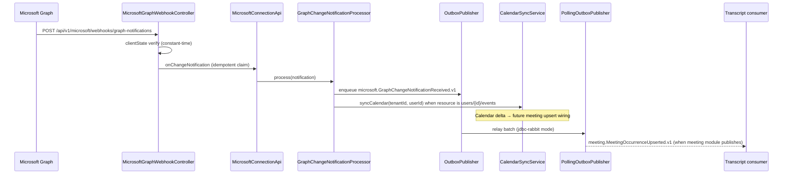

# Wave 5 — Product E2E loop wiring

## Scope

Connect Microsoft Graph change notifications to durable work and calendar sync; scaffold prod Graph mail delivery; document subscription/inbox handoff.

## Happy path (sequence)



## Components

| Class | Role |
|-------|------|
| `GraphChangeNotificationProcessor` | After idempotent claim: enqueues `microsoft.GraphChangeNotificationReceived.v1`; triggers `syncCalendar` for mailbox event resources |
| `MicrosoftGraphWebhookController` | Dispatches to processor instead of no-op handler |
| `MicrosoftGraphMailProvider` | Prod delivery mail port (`actenora.delivery.mail.provider=microsoft-graph`) |
| `MicrosoftConnectionModuleConfiguration` | CERTIFICATE auth + `GraphMailGateway` (pre-existing) |

## SubscriptionStore / NotificationInbox

| Store | Current | Wave 5 |
|-------|---------|--------|
| `InMemorySubscriptionStore` | Default when no JDBC bean | Retained; process-local dedup |
| `InMemoryNotificationInbox` | Idempotent `claim` for webhook dedup | Retained |
| JDBC adapters | Deferred | Documented handoff: JDBC must preserve `claim(consumer, notificationId)` contract from Wave 1 messaging patterns |

Platform webhook binding uses `MicrosoftConnectionApi.onChangeNotification` which already claims via `NotificationInbox` before invoking the processor.

## Configuration

```yaml
actenora:
  microsoft-graph:
    enabled: true
    webhook:
      client-state: ${ACTENORA_MICROSOFT_GRAPH_CLIENT_STATE}
  delivery:
    mail:
      provider: microsoft-graph
      graph-sender: ${ACTENORA_DELIVERY_GRAPH_SENDER}
  messaging:
    mode: jdbc-rabbit   # optional; enables outbox enqueue from processor
```

## Tests

```bash
mvn -pl apps/platform-backend test -Dtest=MicrosoftGraphWebhookBindingTest,GraphChangeNotificationProcessorTest
```

## Exit criteria

- [x] Webhook change handler enqueues outbox work item
- [x] Calendar mailbox notifications trigger `syncCalendar`
- [x] Graph mail provider scaffold for prod CERTIFICATE path
- [x] InMemory → JDBC handoff documented
- [x] Sequence diagram of happy path

## Deferred

- Meeting occurrence creation from calendar events (requires tenant user mapping + business context)
- Graph Mail.Send HTTP transport from delivery module (port validates config; HTTP in microsoft-connection BC)
- JDBC `SubscriptionStore` / `NotificationInbox` adapters
